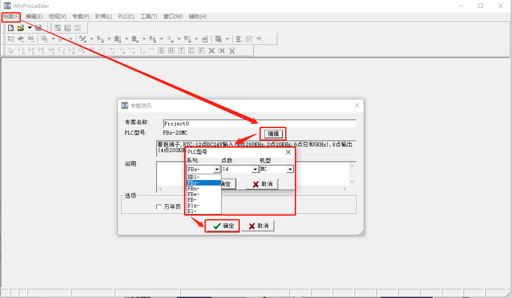
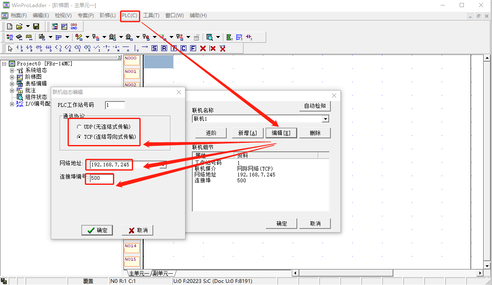
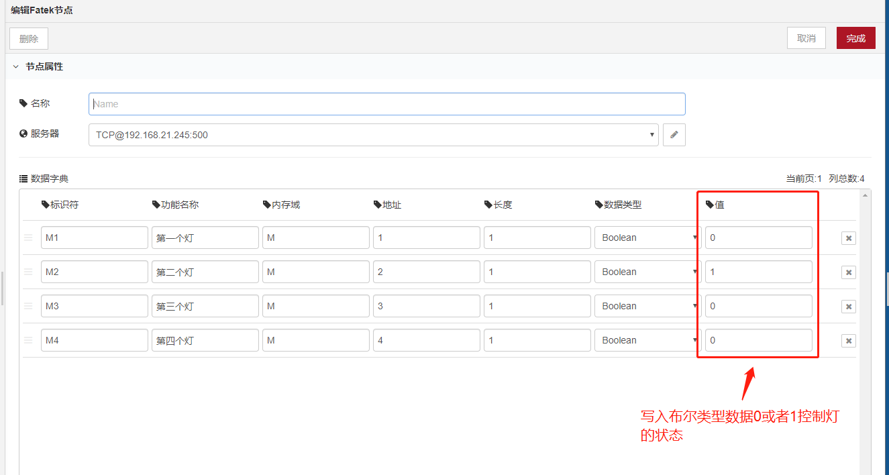
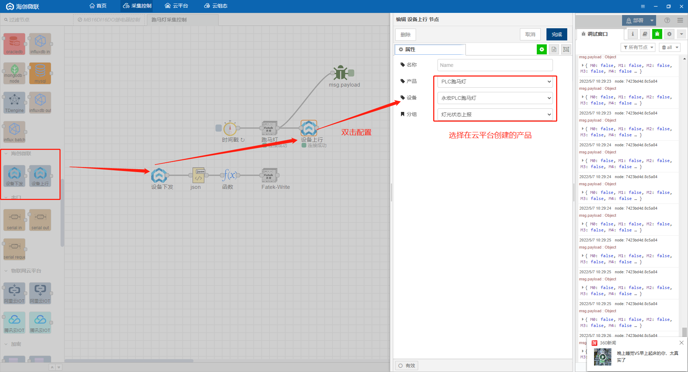
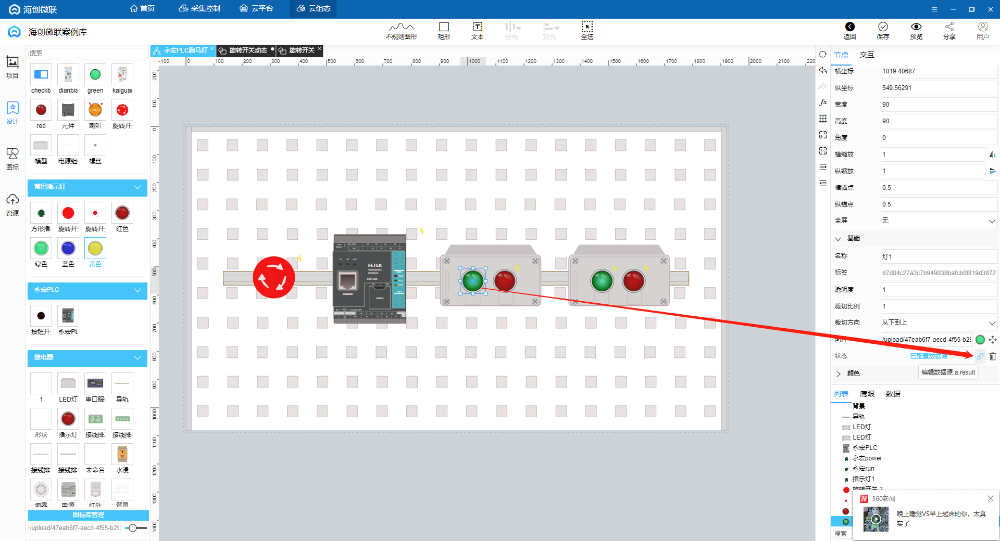

# 如何使用IoT-Fast组态软件采集监控永宏PLC的IO点位状态

本文将通过永宏PLC点位采集控制的组态案例和大家分享一款名为IoT-Fast的物联网软件。

软件集合了数据采集、上报云端、图形组态为一体，仅三步就让你快速完成设备的数据采集控制组态项目，下面我们详细介绍该套软件的操作案例，以采集监控永宏PLC的IO点位状态为例，文章主要分为五个部分：

+ 前期准备

> 永宏跑马灯的介绍：设备的连线，串口服务器IP和端口的配置。
>

+ IoT-Fast-采集控制系统

> 对底层设备进行数据读取、写入的配置界面，还可以进行数据处理。
>

+ IoT-Fast-云平台

> 将采集控制系统收集的数据进行分类展示、告警阈值设置、历史数据查询等功能。
>

+ IoT-Fast-云组态

> 进行2D组态，组态元素绑定云平台上展示的数据，来进行动作的执行或是数据展示。
>

+ IoT-Fast-App

> 通过手机app进行远程数据的查看，以及动作的执行。
>

## 一、前期准备
### 1.1 准备工具
实现采集监控永宏PLC的IO点状态组态案例，需要准备以下工具：

+  一台永宏plc，该案例采用的永宏PLC型号为FBs-14MCR2-AC； 
+  一个按钮开关，用于物理控制跑马灯启动关闭； 
+  一对LED灯，该案例采用四个灯展示。 

此案例所使用的永宏PLC正面有一个网口，除此之外，分别还有电源、外部接门磁门锁的485口和接读卡器的韦根接口。这里只需要把电源和网线接上就行。但需要给永宏PLC先分配一个IP地址（新设备会有一个初始IP地址），我们需要下载修改IP的软件Fatek Ethernet Module Configuration setup进行IP设置。

### 1.2 永宏PLC软件WinProladder应用
首先简单说明一下WinProladder的使用，是永宏PLC的编程软件之一，用于编写梯形图和修改PLC参数等。

#### 1.2.1 连接PLC
打开WinProladder软件，单击**档案**，选择**开新专案**，点击**编辑**，选择PLC的型号，点击确定，具体操作如下。

#### 1.2.2 修改软件连接设备的IP地址和配置端口
在**PLC**中找到**联机**，点击**编辑**，修改PLC的IP地址和本地模块一致。配置端口和勾选连接机制，最后点击确定即可。（如果是新的PLC首次连接，要先将电脑IP修改为和PLC同一个网段，PLC和电脑用网线直连通讯，然后修改PLC的IP，重启PLC之后就可以通过交换机以太网通讯了。）

### 1.3 梯形图
#### 1.3.1 编写
WinProladder中输入为X，输出为Y，中间寄存器为M。M可读可写，X和Y可读，因此要控制输出点Y的通断，只能通过M或其它可写入点间接控制Y，如下图，用M1、M2、M3、M4分别控制输出Y1、Y2、Y3、Y4。

#### 1.3.2 联机
写好程序后，点击**PLC**下的**联机**，将程序和参数下载到PLC当中，再点击**执行**。

## 三、IoT-Fast-采集控制系统
使用IoT-Fast采集控制系统对永宏PLC跑马灯进行采集和控制。

### 1.控件选择
从左边的控制引擎和采集引擎中分别拖出永宏控件。

按下图配置，上面是是读取的采集引擎，下面是写入的控制引擎。

### 2.控件节点配置
Fatek-Write的配置如下:

| 添加4个控制量，分别为M1-M4，类型为布尔，值就是写入的值（0或者1） | 地址和端口是根据配置好的PLC地址和端口填入 |
| --- | --- |
|  |  |

Fatek-Read的配置大致相同，读取M0-M4以及Y1-Y4 9个点的状态。

配置完成后，在Fatek-Write节点中将M1和M3的值改成1，然后点击部署。

### 3.流程部署调试
点击写入定时器，调试界面显示写入成功，然后点击读取定时器，显示M1和M3以及Y1和Y3的值为true。

回到WinProladder的监视界面，可以看到M1和M3以及Y1和Y3闭合。

再试一次，M1-M4写入0101，点击部署，点击写入和读取定时器，查看WinProladder的监视界面。

成功对PLC进行读取和写入了，文章末尾附上快速复用码，导入便可快速部署。

## 四、IoT-Fast-云平台
**IoT-Fast云平台**能够与**IoT-Fast采集控制系统**进行联动，将采集到的数据可视化。

### 1. 产品和设备的创建
登录**IoT-Fast云平台**，依次点击设备管理-产品-创建产品。

然后在该产品下创建一个设备，操作顺序如下图，最后点击确定即可。

### 2. 采集量的定义
回头查看刚刚创建的产品，在功能定义中，自定义功能中添加采集量。

**注**：**标识符**一定要和采集引擎中的**标识符**一致，功能名称无所谓。

所有灯光功能自定义添加完成如下：

### 3. 可视化控件部署调试
回到IoT-Fast采集控制系统，在IoT-Fast云平台中拖出海创上行和下发，点击节点进行产品设备的选择配置。控件显示连接成功后，读取数据的数据即可展示在右方调试界面。

回到**IoT-Fast云平台**，在设备的运行状态中可以实时显示LED灯的状态了。

## 五、IoT-Fast-云组态
完成组态的创建需要以下三个小步骤：

### 4.1 创建项目及应用
点击云组态按钮进入**云组态**首页。

先新建一个项目，填写项目名称，保存，进入项目。

点击**应用**-**我的应用**，点击图示位置新增一张图纸，来构建组态。

填写图纸名称后就可以开始画组态图了。

### 4.2 设计所需模型图标
以在左侧项目树中选择**图标**使用现成的组件，也可以在**设计**中设计自己需要的组件。设计完成的个性化组件可以直接拉到后面你所创建项目图纸中，重复使用，方便快捷。

下面以LED指示灯为例，介绍软件绘画中涉及线段、图形、文本、图形对齐的编辑，以及修改图形的背景颜色、线条宽度等操作。具体操作入径如下图所示，是不是很明了简单呢。

组件基础部分设计完成后，即可拖拽至项目应用图纸中。

灯光组件中的LED灯颜色是不同的，并且满足可控制可绑定数据的要求，我们需要单独进行LED指示灯组件的设计，设计过程和上面介绍相同。

然后我们将指示灯组件拖拽至项目应用图纸中，在原有基础上设定该指示灯接通和断开状态的颜色。

### 4.3 绑定云平台数据
图形绘画完成，下一步就可以通过采集系统采集到的设备灯光状态上传至云平台的数据绑定到组态上。只要我们选中指定灯光组件，点击基础配置页面中绑定数据源按钮。

在弹出的标签页中**选择数据源**-设备，**来源**-我的，**产品**-云平台创建的产品，**设备**-云平台创建的设备，**属性**-选择灯1状态，点击确定。下面的灯光以及其他的设备数据源同理，进行绑定。

全部完成后点击**保存**，然后点击右上角的**预览**，即可查看组态的永宏PLC跑马灯动态效果。

在这个案例中我们详细介绍一下交互的功能操作，即通过点击组态上的设备控制实际的设备执行相应的操作。以灯光1为例，鼠标单击灯光1节点让实际的灯光1设备亮起。

首先我们点击灯光1节点，在“交互”操作栏下选择“鼠标单击时”。

在弹出的标签页中，点击“添加条件”

我们设置灯光1实际为亮的情况下为前提条件

上一步操作确定后会返回事件编辑页面，我们选择“数据反馈”，弹出动作配置页面，选择相应设备属性，配置值为false，即关闭灯光1。

其他节点依照此操作一一配置完成，返回组态页面，即可实现灯光单点控制。

## 五、IoT-Fast-微信小程序/APP
软件上的数据支持在**微信小程序**或者**APP**上查看，小程序和APP的二维码在**云平台**首页的右侧，目前只支持安卓APP，ios的用户可以直接用微信小程序查看。

扫码进入IoT-Fast小程序，输入PC端注册的账号密码进入首页。

选择永宏PLC跑马灯设备，点击查看可以看到设备的详细信息。

点击运行状态右侧箭头可以查看设备的实时数据。

点击设备控制右侧箭头可以控制设备的状态。

回到首页，点击组态查看该账号下的所有组态，选择永宏PLC跑马灯这个组态，点击查看。

在组态页面中同样支持灯的单点控制。

> 更新: 2024-03-21 14:19:45  
> 原文: <https://www.yuque.com/iot-fast/ckyq/cyrvoe>