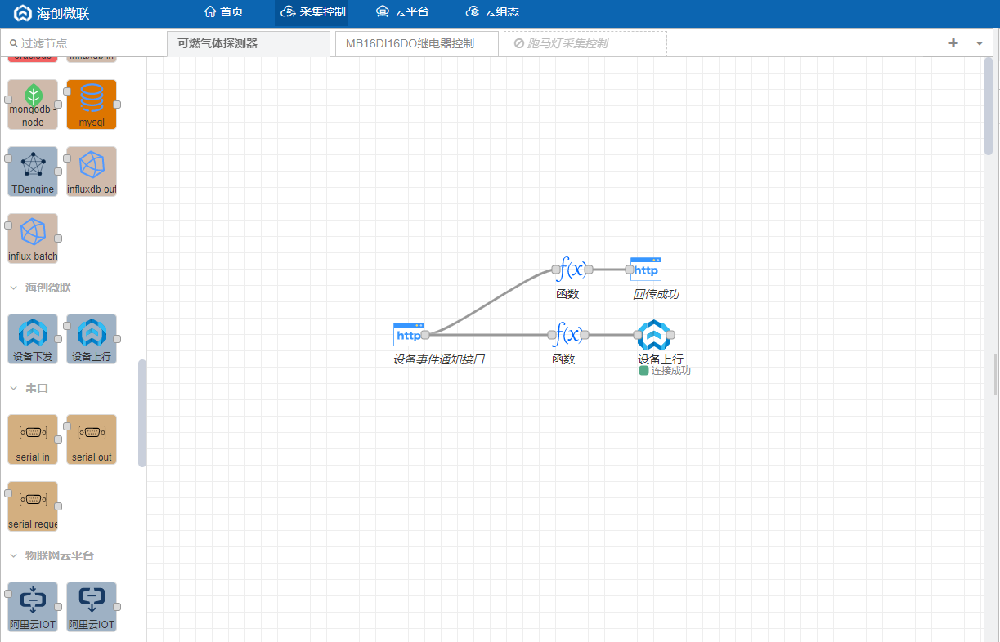

# 教程丨十分钟实现可燃气体探测器组态数据采集

本文将通过可燃气体探测器数据采集的组态案例和大家分享一款名为IoT-Fast的免费软件。

软件集合了数据采集、上报云端、图形组态为一体，仅三步就让你快速完成设备的数据采集控制组态项目，下面我们详细介绍该套软件的操作案例，以采集可燃气体探测器数据为例，文章主要分为五个部分：

+ 前期准备

> 可燃气体探测器设备概述
>

+ IoT-Fast-采集控制系统

> 对底层设备进行数据读取、写入的配置界面，还可以进行数据处理。
>

+ IoT-Fast-云平台

> 将采集控制系统收集的数据进行分类展示、告警阈值设置、历史数据查询等功能。
>

+ IoT-Fast-云组态

> 进行2D组态，组态元素绑定云平台上展示的数据，来进行动作的执行或是数据展示。
>

+ IoT-Fast-App

> 通过手机app进行远程数据的查看，以及动作的执行。
>

## 一、前期准备
### 1.1 准备工具
该设备为无线可燃气体探测器（NB-IOT），采用简易式壁挂安装，安装调试便捷快速。

## 三、IoT-Fast-采集控制系统
使用IoT-Fast采集控制系统对可燃气体探测器进行采集。

### 1.控件选择
设备采用NB-IOT联网方式，支持http通讯协议，所以从左边的采集引擎中拖出http in 节点。选择设备数据请求方式，填写URL地址。

此时先拉取一个调试节点调试部署，从右方调试窗口得到数据，验证通讯成功。

能够成功获取设备数据，我们需要回传数据传输成功的信息。

为了探测器上报的数据能传到云平台，我们需要对设备传输的数据格式进行调整，部署function函数节点。

格式我们可以从云平台创建好的燃气探测器设备调试窗口中复制，具体云平台如何创建设备详见下文。

文章末尾附上快速复用码，导入便可快速部署。

## 四、IoT-Fast-云平台
**IoT-Fast云**平台能够与IoT-Fast采集控制系统进行联动，将采集到的数据可视化。

### 1. 产品和设备的创建
登录**IoT-Fast云平台**，依次点击设备管理-产品-创建产品。

然后在该产品下创建一个设备，操作顺序如下图，选择上一步创建的产品，设置设备名称，最后点击确定即可。

### 2. 采集量的定义
回头查看刚刚创建的产品，在功能定义中，自定义功能中添加采集量。

**注**：**标识符**一定要和采集函数节点中的**标识符**一致，功能名称无所谓。

所有探测器功能自定义添加完成如下：

### 3. 可视化控件部署调试
回到**IoT-Fast采集控制系统**，在**IoT-Fast云平台**中拖出**设备上行控件**，点击节点进行产品设备的选择配置。

控件显示连接成功后，即可回到**IoT-Fast云平台**，在设备的运行状态中可以实时显示可燃气体探测器设备监测数据。

## 五、IoT-Fast-云组态
完成组态的创建需要以下三个小步骤：

### 4.1 创建项目及应用
点击云组态按钮进入**云组态**首页。

先新建一个项目，填写项目名称，保存，进入项目。

点击**应用**-**我的应用**，点击图示位置新增一张图纸，来构建组态。

填写图纸名称后就可以开始画组态图了。

### 4.2 设计所需模型图标
以在左侧项目树中选择**图标**使用现成的组件，也可以在**设计**中设计自己需要的组件。设计完成的个性化组件可以直接拉到后面你所创建项目图纸中，重复使用，方便快捷。

下面以可燃气体探测器为例，根据一张图介绍软件绘画中涉及线段、图形、文本、图形对齐的编辑方式，以及修改图形的背景颜色、线条宽度等操作。具体操作入径如下图所示。

### 4.3 绑定云平台数据
组件基础部分设计完成后，即可拖拽至项目应用图纸中。首先我们需要从图标栏中的基础部分拖出“数字”模块。

修改对应颜色后，即可点击数据源按钮进行数据的绑定。原理是通过采集系统采集到的设备燃气浓度数据上传至云平台的数据绑定到组态上。

点击数据源按钮，在弹出的标签页中**选择数据源**-设备，**来源**-我的，**产品**-云平台创建的产品，**设备**-云平台创建的设备，**属性**-选择燃气浓度，点击确定。图形下方的的电源指示灯以及其他的设备数据源同理，进行绑定。

全部完成后点击**保存**，然后点击右上角的**预览**，即可查看组态的可燃气体探测器采集动态效果。

## 五、IoT-Fast-微信小程序/APP
软件上的数据支持在**微信小程序**或者**APP**上查看，小程序和APP的二维码在**云平台**首页的右侧，目前只支持安卓APP，ios的用户可以直接用微信小程序查看。

扫码进入IoT-Fast小程序，输入PC端注册的账号密码进入首页。

选择可燃气体探测器设备，点击查看可以看到设备的详细信息。

点击运行状态右侧箭头可以查看设备的实时数据。

回到首页，点击组态查看该账号下的所有组态，选择可燃气体探测器这个组态，点击查看。

> 更新: 2024-03-21 14:19:49  
> 原文: <https://www.yuque.com/iot-fast/ckyq/sygngs>