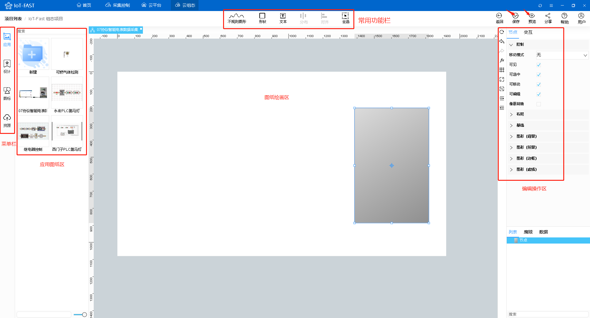
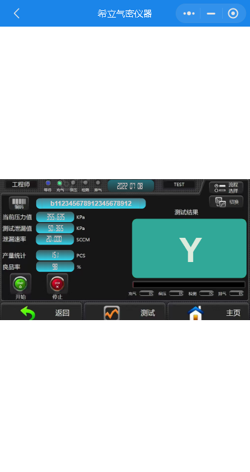

# 海立姆泄漏检测仪设备数据采集

本文分享一篇通过IoT-Fast软件完成海立姆泄漏检测仪设备的数据采集案例。

文章主要共分为五个部分：

+ 前期准备

> 网络通信部署，了解通信协议，获取采集点位。
>

+ **IoT-Fast**-采集控制系统

> 对底层设备进行数据读取、写入的配置界面，还可以进行数据处理。
>

+ **IoT-Fast**-云平台

> 将采集控制系统收集的数据进行分类展示、告警阈值设置、历史数据查询等功能。
>

+ **IoT-Fast**-云组态

> 进行2D组态，组态元素绑定云平台上展示的数据，来进行动作的执行或是数据展示。
>

+ **IoT-Fast**-微信小程序/App

> 通过微信小程序或者手机app进行远程数据的查看，以及动作的执行。
>

## 一 前期准备
### 1.1 通信
将海立姆泄漏检测仪与电脑设置同一网段，接入同一个交换机保证网络可互相通信。

### 1.2 获取数据地址说明
获取海立姆泄漏检测仪通信协议以及数据地址说明，由下图知该设备为Modbus tcp 的通信协议

### 1.3 **IoT-Fast**采集软件
**IoT-Fast**是一款集合了数据采集、上报云端、图形组态为一体的软件。

通过部署**采集控制**定时读取海立姆泄漏检测仪设备点位数据，将采集到的信息上传至IoT-Fast**云平台**。

## 二 IoT-Fast-采集控制系统
打开IoT-Fast的**采集控制**系统，在左侧采集引擎节点区找到**Modbus**，按住鼠标左键拖入到中间的配置区。

再从从左侧通用节点区拉出**定时器**和**调试**控件，与**Modbus**控件节点连起来，以完成网络中信息的发送接收和转发。（定时器用于定时或手动触发采集控件采集信息，调试是为了采集控件采集到的数据展示至右侧数据窗口。)

双击**Modbus**控件配置海立姆泄漏检测仪的连接地址以及采集的数据字典（数据地址）。

根据在准备阶段设置的海立姆泄漏检测仪设备地址，点击服务器地址配置项，按要求将设备地址填入服务器配置信息。

按照海立姆泄漏检测仪的设备数据域,选取相关的点位进行采集。

点击数据字典**添加**按钮，添加压力、泄漏值、存盘条码，4区对应功能码FC3的三条数据点位。

由于条码点位采集上来的数据与现场实际数据存在错位的情况，所以我们需要对条码的数据进行处理，插入function函数，通过调整得到我们需要的条码数据。

双击**定时器**自定义设置定时器采集时间。

然后点击右上角的**部署**按钮，部署完成后**modbus**显示已连接，右侧的界面调到**调试窗口**显示压力、泄漏值、存盘条码三条数据。

另外寄存器0区，即功能码为FC1的点位需要采集，但是该点位寄存器区不同不能放在同一个modbus采集引擎中采集。所以我们重新再拉取一个modbus采集引擎组件，按照同样服务器地址配置，添加一条被检测设备是否通过检测达标的数据点位，如下所示：

如果需要通过用"Y"表示，NG用"N"表示，则在该组件后对数据添加function函数处理，如下：

以上数据需要配合传送时间以及设备号，所以我们可以继续添加一个function函数，增加时间以及设备号的内容：

最后将以上6个采集节点数据通过**join**组件汇总成一个负载内容输出，如下所示：

由于这样采集到的数据会重复，我们需要对采集上来的数据做判断过滤，此时需要一个变量点位，即通道号为26的**测试_检测**点位。该地址寄存器功能码同样为FC3类型，相同操作添加点位和服务器地址如下：

采集上来的**测试_检测**点位是一个布尔值，即设备在运行时为true，结束时为false。

根据上传数据的规则，一台检测设备结束后才会上传一次，所以我们需要作true转false时，才可以进行下部分的压力、泄漏值、存盘条码数据采集，所以其后增加一个作比较的function函数。function里写入true转false时的代码，即前一次值和后一次比较，有变化输出一个设备检测状态值，即change、

将change值放入switch判断用的组件中，如果状态为假（有变化),即可进入下部分的点位数据采集。

过滤输出所需要的内容如下：

数据读取到之后，就可以将数据传到**云平台**显示，然后再进行**云组态**。

## 三 IoT-Fast-云平台
### 3.1 创建产品
点击云平台按钮进入**云平台**首页。

点击左侧**产品中心**-**产品开发**，新增一个产品。

查看创建的产品，在**功能定义**-**自定义参数**中新增属性。

创建配置如下，**标识符**与**采集控制**上的**key**值对应，同一个产品中不能有重复的**标识符**。

  

创建完成后的自定义参数如下：

在**功能定义**-**分组**中创建一个上报分组，类型选择上报，将左边的点位全选，点击右箭头，加入到当前分组中。

如此下文中添加的设备是关联该产品的情况下，自动附带以上上报下发分组的属性，方便批量设备增加的过程。

### 3.2 添加设备
点击**产品中心**-**设备管理**，在该产品下增加一个设备。

然后就是云平台和采集控制中的属性进行绑定，我们需要回到**采集控制**系统，从左侧云平台中拉出**微联云上行**控件，用于将采集的数据上报**云平台**。

双击控件选择将数据上报到**云平台**的气密仪器产品、设备和分组中。

### 3.3 查看数据
回到**云平台**，查看设备的**运行状态**，可以看到数据已经上传上来了。

这样便配置好了**采集控制**和**云平台**的联动，接着可以去**云组态**进行2D组态，用图形展示数据。

## 四 IoT-Fast-云组态
### 4.1 添加应用图纸
点击云组态按钮进入**云组态**首页。

先新建一个项目，填写项目名称，保存，进入项目。

点击**应用**-**我的应用**，点击图示位置新增一张图纸，来构建组态。

填写图纸名称后就可以开始画组态图了。

### 4.2 组态绘制基础部分

由上面划分，我们可以在**设计**中设计自己需要的组件。设计完成的个性化组件可以直接拉到后面你所创建项目图纸中，重复使用，方便快捷

当然也可在左侧菜单栏中选择**图标**使用现成的组件

可以点击**资源**，上传截图的图片资源。

在**常用功能栏**进行所需组件的绘制，例如添加图形、添加文本、图形之间的对齐等。

在**编辑操作区**主要是对图形边框、背影、是否立体进行操作。

### 4.3 绑定云平台数据
点击**数据源**按钮，在弹出的标签页中**选择数据源**-设备，**来源**-我的，**产品**-云平台创建的产品，**设备**-云平台创建的设备，**属性**-选择条码，点击确定。图形下方的数据源同理，依次进行绑定。

全部完成后点击**保存**，然后点击右上角的**预览**，即可查看组态的希立气密仪器的采集动态效果。

## 五 IoT-Fast-微信小程序/APP
软件上的数据支持在**微信小程序**或者**APP**上查看，小程序和APP的二维码在**云平台**首页的右侧，目前只支持安卓APP，ios的用户可以直接用微信小程序查看。

扫码进入**IoT-Fast**小程序，输入PC端注册的账号密码。

进入首页，可以看到产品和设备数量，点击**设备**查看该账号下的所有设备。

选择希立气密仪器，点击查看。

可以看到设备的详细信息，点击运行状态查看数据。

回到首页，点击**组态**查看该账号下的所有组态，选择希立气密仪器，点击查看。

效果和PC端是一样的。

> 更新: 2024-03-21 14:20:17  
> 原文: <https://www.yuque.com/iot-fast/ckyq/lif46h>