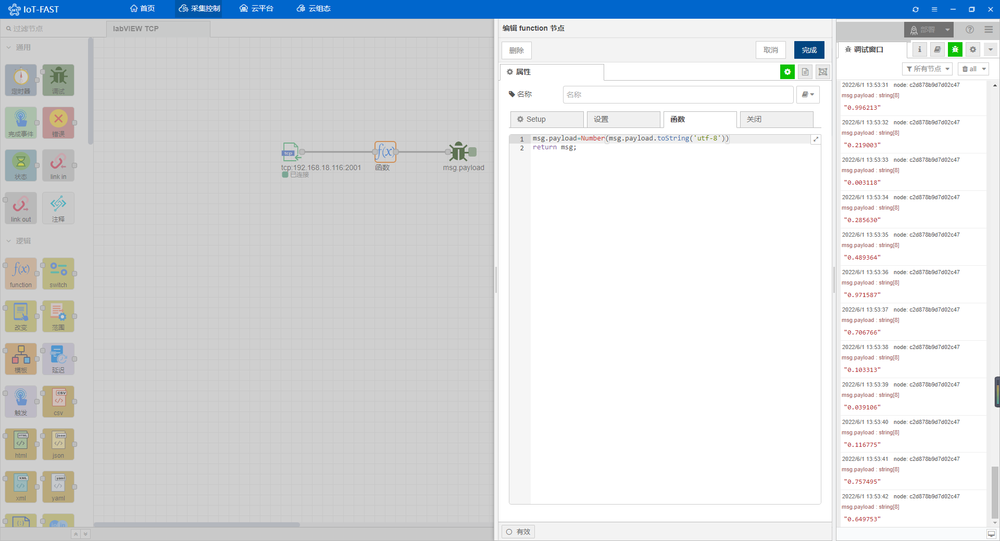
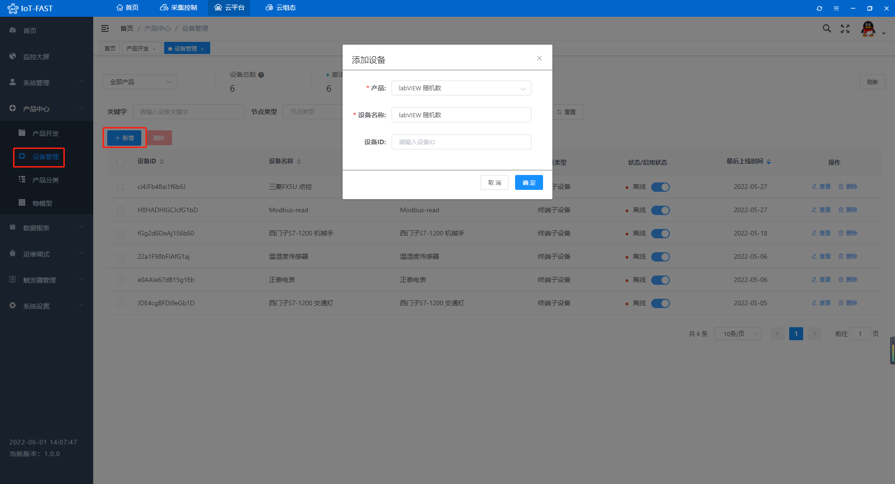

# 采集labVIEW数据，IoT-Fast帮你搞定

第三方软件如何获取**labVIEW**数据，**IoT-Fast**来帮忙，**IoT-Fast**<font style="color:rgb(44, 62, 80);">是一款</font>集合了数据采集、上报云端、图形组态为一体的软件

文章以**labVIEW**模拟数值为例，包括TCP的vi编程，采集，上云，组态，共分为五个部分：

+ **labVIEW**介绍

> 简单介绍labVIEW，编写TCP连接的程序框图和前面板。
>

+ **IoT-Fast-**采集控制系统

> 对底层设备进行数据读取、写入的配置界面，还可以进行数据处理。
>

+ **IoT-Fast**-云平台

> 将采集控制系统收集的数据进行分类展示、告警阈值设置、历史数据查询等功能。
>

+ **IoT-Fast**-云组态

> 进行2D组态，组态元素绑定云平台上展示的数据，来进行动作的执行或是数据展示。
>

+ **IoT-Fast**-微信小程序/App

> 通过微信小程序或者手机app进行远程数据的查看，以及动作的执行。
>

### 一、labVIEW
**labVIEW**是一种程序开发环境，使用的是图形化编辑语言G编写程序，我们需要用labVIEW模拟数据，然后**IoT-Fast**通过TCP协议获取到数据进行处理展示。


打开labVIEW，创建一个vi，编写一个TCP的程序框图如下，TCP的ip为本机ip，端口这里写的是2000。


前面板是一个字符串输入控件，配上确定按钮，编写完成后点击左上角的运行按钮，让程序运行起来。


### 二、**IoT-Fast**-采集控制系统
打开IoT-Fast的**采集控制**系统，选择左边的节点，按住鼠标左键拖入到中间的配置栏。


从左侧的控件栏拉出一个**TCP in**控件和一个**调试**控件。

 

双击**TCP in**控件配置连接IP和端口。


按住白色小框可以拉出一条线连接上另一个白色小框。这样就将两个控件用线连接起来，数据是**从左往右**流动的，最后流入调试控件就会在右侧的调试窗口显示。


按下图连接后点击右上角的**部署**按钮，将右侧的界面调到**调试窗口**，部署完成后**TCP in**显示已连接。


回到labVIEW的前面板，在输入框中写上发送的内容，然后点击确定。


可以看到IoT-Fast这边收到了一串Buffer，说明连接是成功的，需要将Buffer做一下编码格式的处理在显示出来。


从左侧拉出**function**控件，将它放在调试控件的前面。


双击编写代码，转成UTF-8的编码格式显示，完成后点击部署。


回到labVIEW重新运行一下程序，等待**TCP in**显示已连接后，输入一串字符，点击确定按钮。


返回IoT-Fast，可以看到数据已经接收到了。


多试几下，调试窗口显示一致。

 


回到labVIEW，再画一个程序框图，内容为频率1秒发送一次0-1之间的随机数，TCP端口为2001，点击运行。


返回IoT-Fast，将**TCP in**的端口改为2001，部署，调试窗口每隔1秒就会输出一个随机数的字符串。


双击**function**控件，将输出类型转成数值，部署，labVIEW重新点击运行。



调试窗口输出的数据类型就变为数值型了，数据读取到之后，就可以将数据传到**云平台**显示，然后再进行**云组态**。


### 三、**IoT-Fast**-云平台
点击云平台按钮进入**云平台**首页。


点击左侧**产品中心**-**产品开发**，新增一个产品，类别选择**自定义品类**。


查看创建的产品，在**功能定义**-**自定义参数**中新增属性。


创建配置如下，**标识符**是采集控制和云平台能够对应上的关键字符，同一个产品中不能有重复的**标识符**。


在**功能定义**-**分组**中创建一个上报分组，类型选择上报，将左边的点位全选，点击右箭头，加入到当前分组中。


接着点击**产品中心**-**设备管理**，在该产品下增加一个设备。



下一步将云平台和采集控制中的属性进行绑定，回到**采集控制**系统，从左侧云平台中拉出**iotfast云上行**控件，用于将采集的数据上报**云平台**。


双击控件就可以选择刚刚在云平台创建的产品、设备和分组了。


将它接在**function**后面，然后双击**function**，将获取到的值赋到标识符的对象下。


**function**中的代码如下，配置好后点击部署，labVIEW重新点击运行。

```javascript
msg.payload={
  "value":Number(msg.payload.toString('utf-8'))
}
return msg;
```

回到**云平台**，查看设备的**运行状态**，可以看到数据已经上传上来了。


这样便配置好了**采集控制**和**云平台**的联动，接着可以去**云组态**进行2D组态，用图形展示数据。

### 四、**IoT-Fast**-云组态
点击云组态按钮进入**云组态**首页。


先新建一个项目，填写项目名称，保存，进入项目。


点击**应用**-**我的应用**，点击图示位置新增一张图纸，来构建组态。


填写图纸名称后就可以开始画组态图了。


可以在左侧项目树中选择**图标**使用现成的组件，也可以在**设计**中设计自己需要的组件。


点击图纸空白处，在右侧修改图纸大小和背景颜色。


从**折线图**文件夹中拖出**实时曲线**，右侧点击箭头处链接的图标绑定云平台数据。**来源**-我的，**产品**-云平台创建的产品，**设备**-云平台创建的设备，**属性**-选择值。


将实时折线的长度拉长到整个图纸。


点击右上角的**保存**，然后点击**预览**，曲线会随时间实时变化。


### 五、**IoT-Fast**-微信小程序/APP
软件上的数据支持在**微信小程序**或者**APP**上查看，小程序和APP的二维码在**云平台**首页的右侧，目前只支持安卓APP，ios的用户可以直接用微信小程序查看。


扫码进入**IoT-Fast**小程序，输入PC端注册的账号密码。


进入首页，可以看到产品和设备数量，点击**设备**查看该账号下的所有设备。


选择labVIEW 随机数，点击查看可以看到设备的详细信息。


回到首页，点击**组态**查看该账号下的所有组态，选择labVIEW 随机数，点击查看。


效果和PC端是一样的，手机查看组态会自动横屏。


> 更新: 2024-03-21 14:19:52  
> 原文: <https://www.yuque.com/iot-fast/ckyq/oqb687>