# 采集数据上传Oracle数据库

如果您采集的设备数据需要上传至Oracle数据库，那就不能错过这一篇教程！本文将会介绍如何通过IoT-Fast软件完成设备数据上传Oracle数据库的对接过程。

文章主要共分为2个部分：

+ **前期准备**

> IoT-Fast软件的下载、Oracle环境部署。
>

+ **IoT-Fast**-采集控制系统部署

> 部署配置Oracle数据库对接流程。
>

## 一 前期准备
### 1.1 **IoT-Fast**采集软件
**IoT-Fast**是一款集合了数据采集、上报云端、图形组态为一体的软件。通过部署**采集控制**定时读取设备数据，将采集到的信息上传至IoT-Fast**云平台或**Oracle数据库。

打开IoT-Fast软件的采集控制页面，开始你采集控制的物联网之旅！

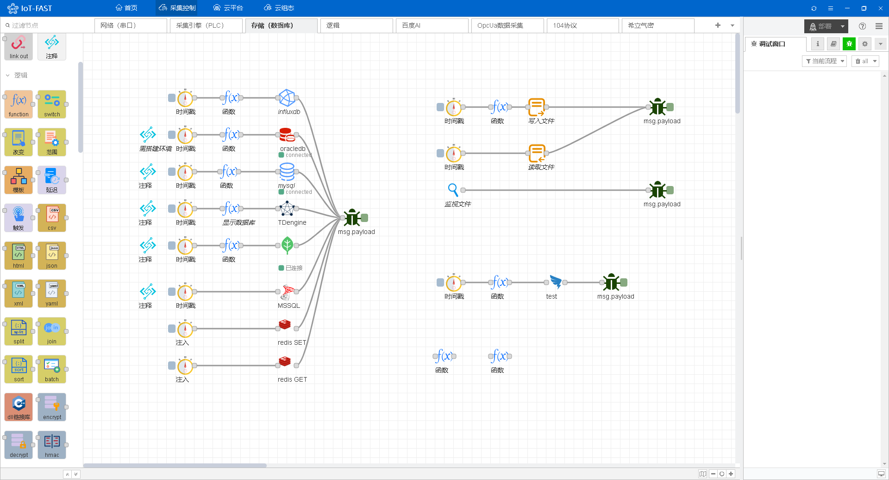

### 1.2 Oracledb客户端环境变量的配置
如果没有进行Oracle数据库客户端环境的安装，则IoT-Fast软件里的Oracle组件无法与Oracle数据库进行通讯连接。那么我们现在前往Oracledb官网，进入[<font style="background-color:rgb(251, 249, 248);">适用于 Microsoft Windows (x64) 64 位的 Oracle Instant Client 下载</font>](https://www.oracle.com/database/technologies/instant-client/winx64-64-downloads.html)<font style="color:rgb(0, 0, 0);background-color:rgb(251, 249, 248);">页面：</font>

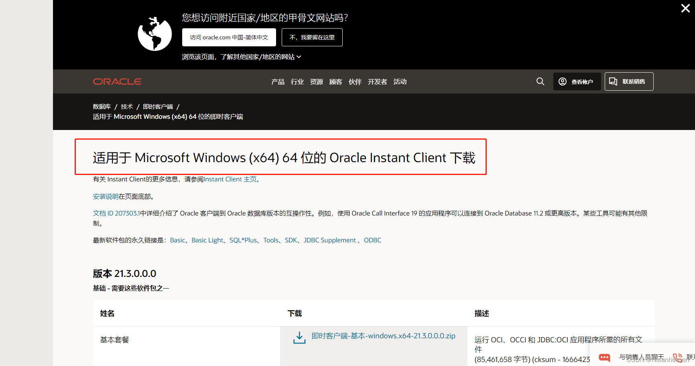

下载安装包需要注册账号并经过审核通过，时间较久，下面直接将下载好的安装包分享给大家：

下载链接：[https://pan.baidu.com/s/1XTbW55YLQrLA5y-rjSMAVw](https://pan.baidu.com/s/1XTbW55YLQrLA5y-rjSMAVw)  提取码：hcwl（永久有效），   经测试，本次下载的客户端安装包虽不支持winds7系统，但其他系统均适用。如果你是winds7系统，需前往官网继续下载支持winds7系统的客户端安装包。

        下载下来的oracledb安装包建议放在盘符根目录下，例如：D:\instantclient_19_12

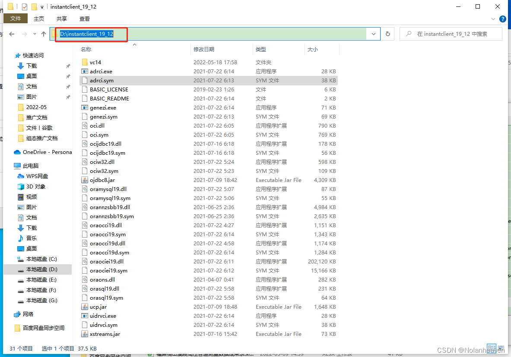

接下来就是进行系统环境变量的配置，按官网要求需要配置三处地方：

1、变量名：ORACLE_HOME，变量值：D:\instantclient_19_12

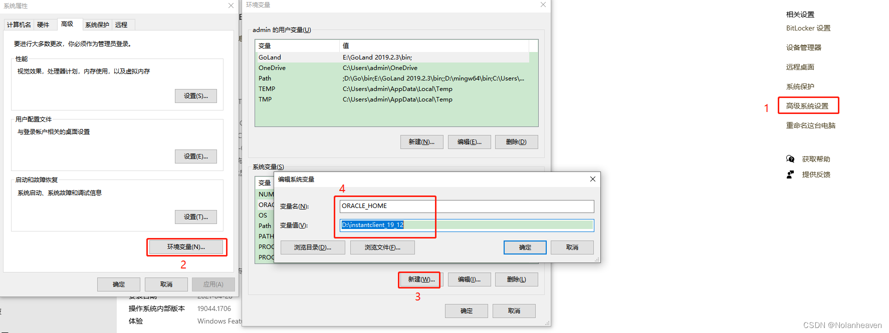

 2、变量名：TNS_ADMIN，变量值：D:\instantclient_19_12

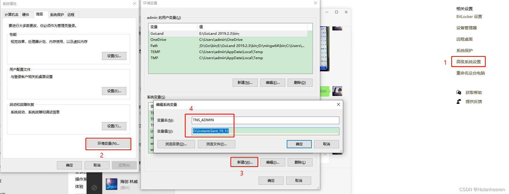

 3、path 新增 D:\instantclient_19_12

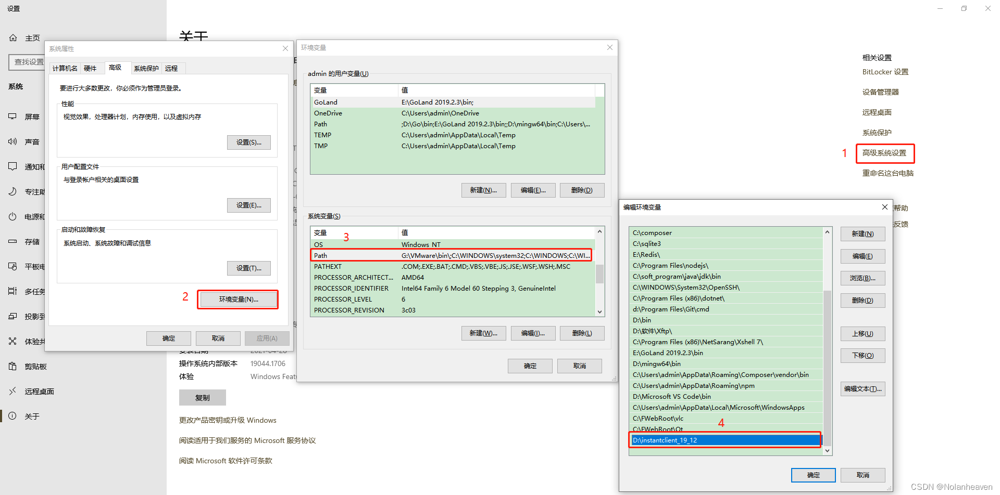

到此windows版本oracle客户端环境配置完成。

Linux系统的采集控制系统会在出厂前布置好，但如果您拿到的Linux系统采集控制软件还未部署oracle客户端环境，按照下述进行操作：

前往Oracledb官网，进入[<font style="background-color:rgb(251, 249, 248);">适用于 Linux x86-64（64 位）的 Oracle Instant Client 下载</font>](https://www.oracle.com/database/technologies/instant-client/linux-x86-64-downloads.html)<font style="color:rgb(0, 0, 0);background-color:rgb(251, 249, 248);">页面：</font>

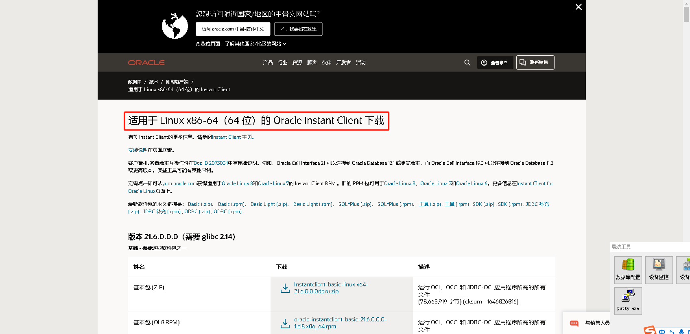

适合的basic包以及<font style="color:rgb(0, 0, 0);background-color:rgb(251, 249, 248);"> SQL*Plus 包中的 sqlplus 等二进制文件下载完毕</font>

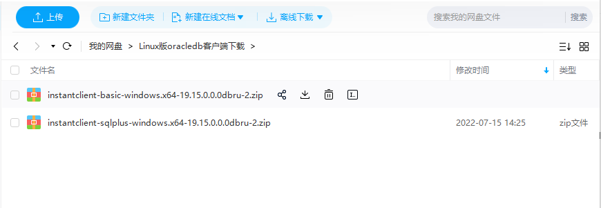

<font style="color:rgb(0, 0, 0);background-color:rgb(251, 249, 248);">下载</font>链接：[https://pan.baidu.com/s/1t0OzNf1CB8giRl321ARpfQ](https://pan.baidu.com/s/1t0OzNf1CB8giRl321ARpfQ)   提取码：hcwl

1. <font style="color:rgb(0, 0, 0);background-color:rgb(251, 249, 248);">将下载下来的安装包解压缩到单个目录中，例如</font><font style="color:rgb(22, 21, 19);background-color:rgb(251, 249, 248);">/opt/oracle/instantclient_19_15，</font><font style="color:rgb(0, 0, 0);background-color:rgb(251, 249, 248);">您的应用程序可以访问的目录：</font>

```plain
cd /opt/oracle      
unzip instantclient-basic-windows.x64-19.15.0.0.0dbru-2.zip
```

2. <font style="color:rgb(0, 0, 0);background-color:rgb(251, 249, 248);">安装操作系统</font><font style="color:rgb(22, 21, 19);">libaio</font><font style="color:rgb(0, 0, 0);background-color:rgb(251, 249, 248);">包。</font><font style="color:rgb(22, 21, 19);">libaio1</font><font style="color:rgb(0, 0, 0);background-color:rgb(251, 249, 248);">这在某些 Linux 发行版上调用：</font>

```plain
sudo apt install libaio-dev
```

3. <font style="color:rgb(0, 0, 0);background-color:rgb(251, 249, 248);">如果 Instant Client 是此系统上安装的唯一 Oracle 软件，则更新运行时链接路径：</font>

```plain
sudo sh -c "echo /opt/oracle/instantclient_19_15 > \
      /etc/ld.so.conf.d/oracle-instantclient.conf"
sudo ldconfig
```

4. <font style="color:rgb(0, 0, 0);background-color:rgb(251, 249, 248);">使用 SQL*Plus 包中的 sqlplus 等二进制文件，请将</font>instantclient-sqlplus-windows.x64-19.15.0.0.0dbru-2<font style="color:rgb(0, 0, 0);background-color:rgb(251, 249, 248);">压缩包中的文件解压后，打开复制里面的文件放置到 Basic 包</font><font style="color:rgb(22, 21, 19);background-color:rgb(251, 249, 248);">instantclient_19_15</font><font style="color:rgb(0, 0, 0);background-color:rgb(251, 249, 248);">相同的文件中去，然后更新您的</font><font style="color:rgb(22, 21, 19);">PATH</font><font style="color:rgb(0, 0, 0);background-color:rgb(251, 249, 248);">环境变量:</font>

```plain
export PATH=/opt/oracle/instantclient_19_15:$PATH
```

5. <font style="color:rgb(0, 0, 0);background-color:rgb(251, 249, 248);">启动您的应用程序。</font>

## 二 IoT-Fast-采集控制系统
打开IoT-Fast的**采集控制**系统，在左侧采集引擎节点区找到**oracledb**，按住鼠标左键拖入到中间的配置区。

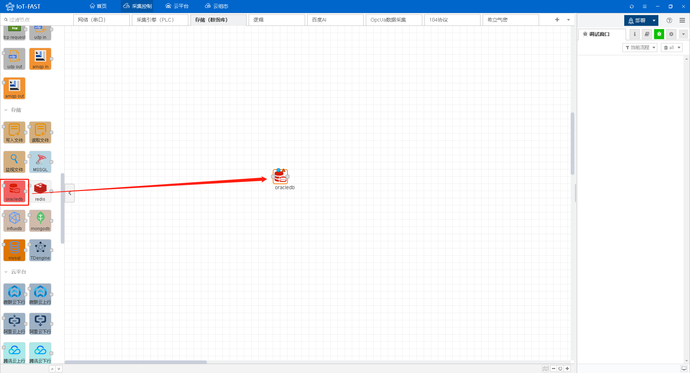

双击**oracledb组件节点，在弹出的配置标签页中点击下图箭头所指位置。**

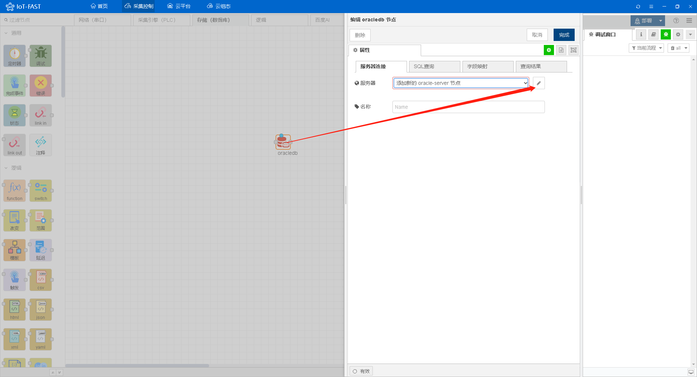

配置服务器地址、端口以及对应的数据库库名。

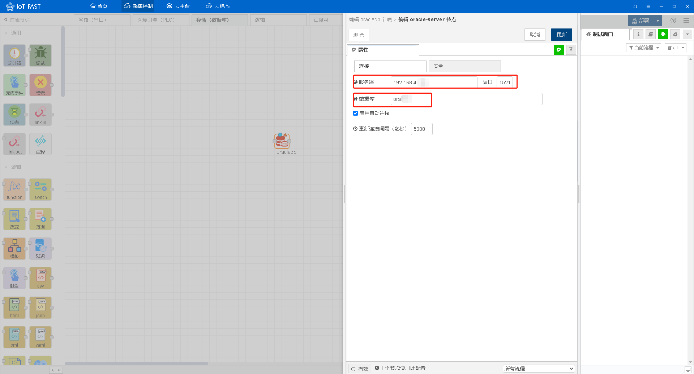

切换至安全页面，输入数据库账户和密码，

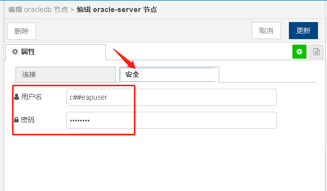

点击部署按钮，即可看到数据库连接成功。

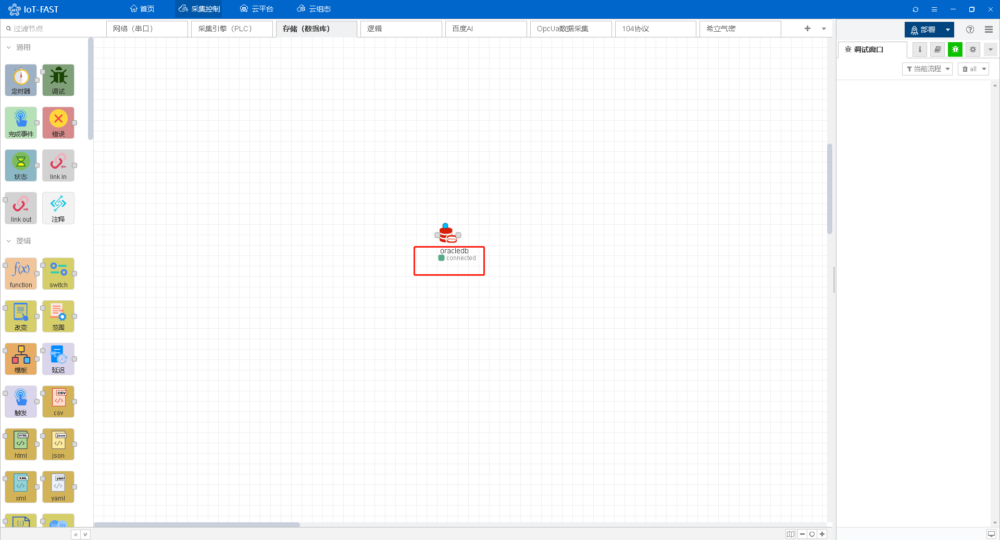

下面，我们可以进行数据库的数据查询、写入等操作。

以查询为例，我们从左侧通用节点区拉出**定时器**、**调试**控件以及function函数，与**oracledb**控件节点连起来，以完成网络中信息的处理、发送接收和转发。（定时器用于定时或手动触发采集控件采集信息，调试是为了采集控件采集到的数据展示至右侧数据窗口。)

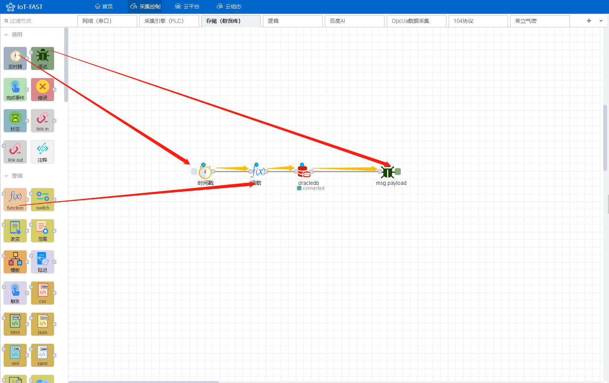

双击function函数，在其中写入数据库查询的语句。

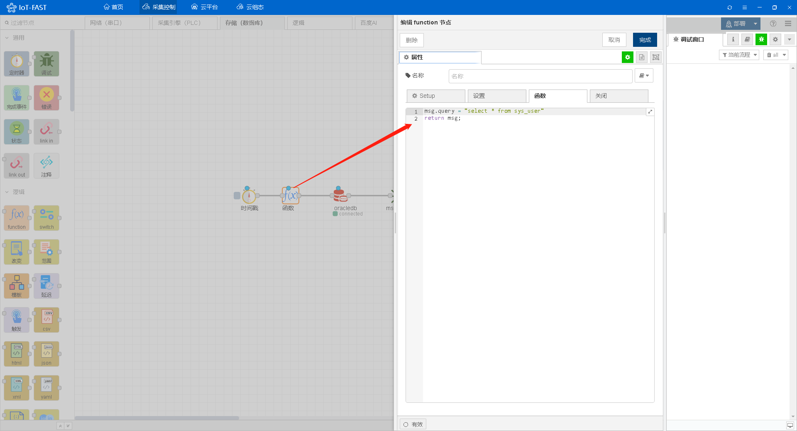

最后点击部署，点击定时器触发查询oracle数据库的操作，通过调试节点，在右侧调试窗口即可看到查询到的数据库数据。

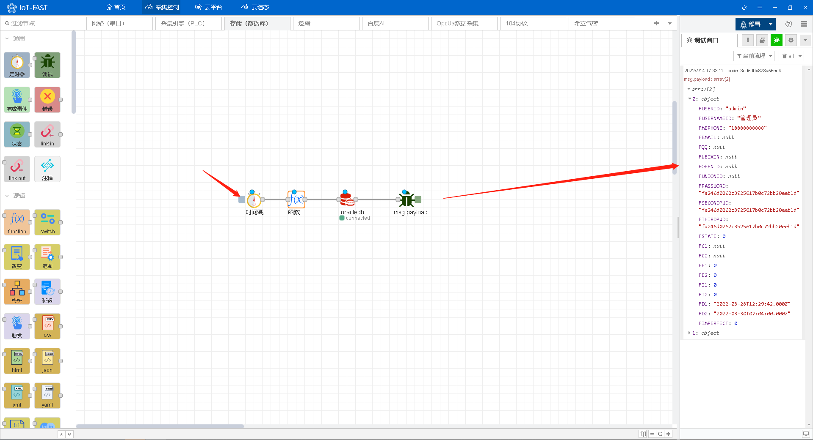

如果您需要将采集到的设备数据写入oracle数据库，需前往数据库查看字段数据，例：

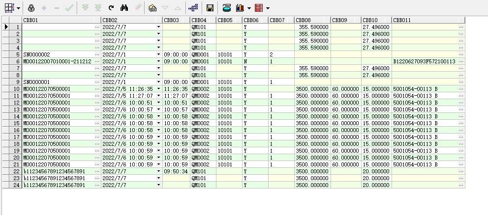

```plain
create table tc_cbb_file(
cbb01  varchar2(40) not null,  /*测试记录SN*/
cbb02  date,         /*检测日期,date 2022/06/01*/
cbb03  varchar2(8),       /*检测时间,time HH:MM:SS*/
cbb04  varchar2(10),     /*机台号,QM0001*/
cbb05  varchar2(5),         /*检测员,工号 10101*/
cbb06  varchar2(1),        /*检测结果,Y/N*/
cbb07  varchar2(10),     /*机台号*/
cbb08  number(6,3),       /*检测压力 Pa*/
cbb09  number(6,3),       /*检测时长 s*/
cbb10  number(6,3),          /*压差值*/
cbb011  varchar2(40)         /*产品追溯码*/
);
```

以上有11个字段，我们先添加一个function函数传入模拟设备数据（如有实际设备传入实际值）。

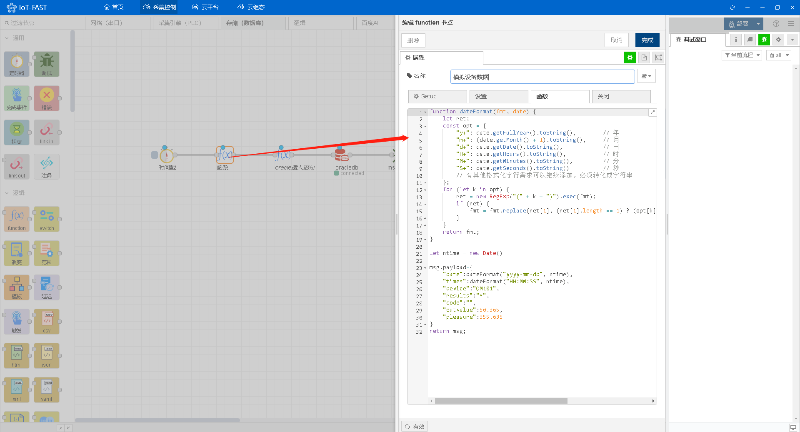

模拟设备数据function函数代码如下：

```plain
function dateFormat(fmt, date) {
    let ret;
    const opt = {
        "y+": date.getFullYear().toString(),        // 年
        "m+": (date.getMonth() + 1).toString(),     // 月
        "d+": date.getDate().toString(),            // 日
        "H+": date.getHours().toString(),           // 时
        "M+": date.getMinutes().toString(),         // 分
        "S+": date.getSeconds().toString()          // 秒
        // 有其他格式化字符需求可以继续添加，必须转化成字符串
    };
    for (let k in opt) {
        ret = new RegExp("(" + k + ")").exec(fmt);
        if (ret) {
            fmt = fmt.replace(ret[1], (ret[1].length == 1) ? (opt[k]) : (opt[k].padStart(ret[1].length, "0")))
        }
    }
    return fmt;
}

let ntime = new Date()

msg.payload={
    "date":dateFormat("yyyy-mm-dd", ntime),
    "times":dateFormat("HH:MM:SS", ntime),
    "device":"QM101",
    "results":"Y",
    "code":"",
    "outvalue":50.365,
    "pressure":355.635
}
return msg;
```

然后我们在oracle插入语句的function中写入插入语句。

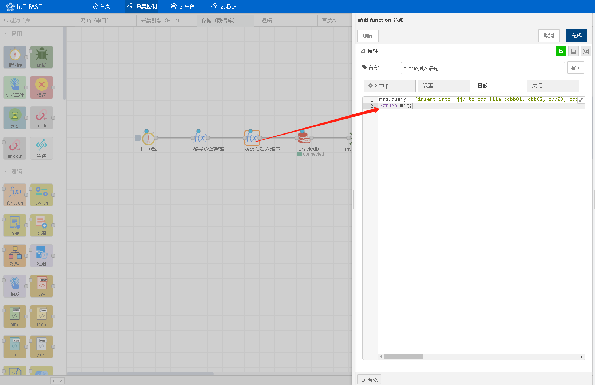

插入数据库代码函数如下：

```plain
msg.query = `insert into fjjp.tc_cbb_file (cbb01, cbb02, cbb03, cbb04, cbb05, cbb06, cbb07, cbb08, cbb09, cbb10, cbb011)values ('${msg.payload.code}', to_date('${msg.payload.date}','yyyy-mm-dd'), '${msg.payload.times}', '${msg.payload.device}', null, '${msg.payload.results}', null,'${msg.payload.pressure}',null,'${msg.payload.outvalue}',null )`
return msg;
```

点击触发器，在右侧调试窗口即可获得写入成功的信息，完成对Oracle数据库写入的操作。

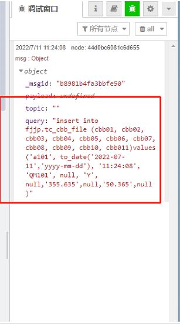


[  
](https://blog.csdn.net/Nolanheaven/article/details/125094583)


> 更新: 2024-03-21 14:20:18  
> 原文: <https://www.yuque.com/iot-fast/ckyq/oklbc2>