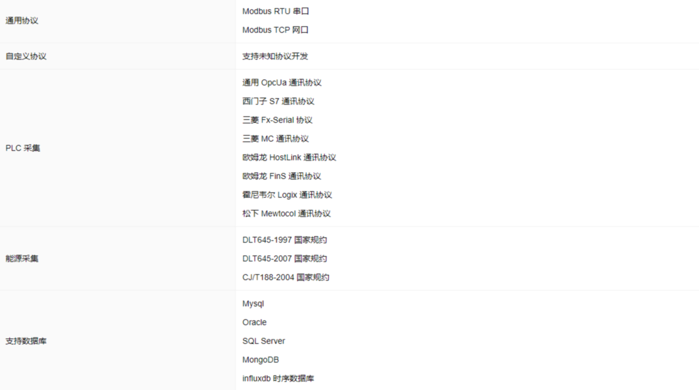

# 产品简介

### 什么是采控引擎？
采控引擎是一个基于物联网，计算机通讯的架构实现的，集成了大部分常见的通讯协议，例如封装了三菱PLC通讯，西门子PLC通讯，欧姆龙PLC通讯，modbus通讯，智能电表、智能水表等等， 这些通讯全部进行了多语言的实现 。同时还实现了跨平台（LINUX、WINDOWS、MAC），跨语言（JavaScript、Node.js、C、python等等），跨客户端（B/S系统，C/S系统，集成桌面客户端，浏览器等等）通讯，让你不再纠结于使用windows还是 linux系统，可以实现日志功能、邮件发送、实时报警、函数计算等功能。

### 采控引擎能干什么？
采控引擎可以应用于任何场景，可以进行万物互联将数据在底层自由的传输，无论是主动的还是被动的，无论是什么系统（采集系统为windows电脑， 或是嵌入式系统，或是基于linux的网关），都可以实现数据的随意传输，方便快捷实现强大，无论您是应用与工业采集，智能园区，城市管理等等，都可以快速而且低成本的实现您的需求，除此之外，他还可以搭建强大的监控功能，生产报表，2D、3D生产全过程仿真，各种工业参数历史数据的追溯，以及全功能的MES系统等等。

采控引擎采集控制系统是基于图形用户界面的设备数据采集控制开发工具。支持拖拽式的操作，交互式的设计器，帮助用户无门槛零编程地开发上位机应用。 可搭载公网和本地的多种数据源，减少数据清洗和变形工作，同时支持自定义协议开发，函数计算能力，数据库使用能力等，满足各类复杂业务需求。力求打造工业设备的通信解决方案，将厂家需求的设备通过采控引擎计算网关接入互联网，利用平台先进的云技术实现大量设备入网通信、数据传输、云计算、远程运维等功能，降低了工厂的投入，也帮助企业尽快跨入工业互联网时代。

### 优势特点
+ 跨平台，支持在LINUX、WINDOWS、MAC系统下运行，同时也支持ARM嵌入式平台。
+ 默认支持与采控引擎设备云集成，更方便的实现数据规则预警、工业APP、微信公众、小程序交互能力，通过授权用户可以随时查看设备状态。
+ 快速与各大物联网平台（百度天工、阿里云、PTC Thingworx、腾讯云等）对接
+ 丰富的云端设备协议库支持，可以根据业务需求同步云端设备协议库，用户了可以自行发布协议到云端库中，共同建设分享完善设备协议库。
+ 开发人员可以使用JavaScript构建组件库，根据设备协议自行处理协议逻辑。
+ 输入和输出层通信协议默认支持tcp、upd、opcua、modbus-tcp、modbus-rtu、soap server、websocket、mqtt、http、serial（串口通信），用户无需了解底层协议知识，更多的关注处理设备或业务层数据包逻辑。
+ 数据存储支持实序数据库、内存数据库、MYSQL、SQL SERVER、NOSQL连接，可根据数据特性自由选择。
+ 快速创建API服务，而无需重启服务程序。
+ 默认自带数据可视化工具，可以将采集的数据以图表或表格等方式展现出来。
+ 平台已经默认完成了市面上80%的PLC品牌协议支持涵盖西门子、欧姆龙、施耐德、罗克韦尔、三菱、松下等知名PLC品牌。

### 协议支持

> 更新: 2024-04-11 20:21:54  
> 原文: <https://www.yuque.com/iot-fast/ckyq/zqhnih>