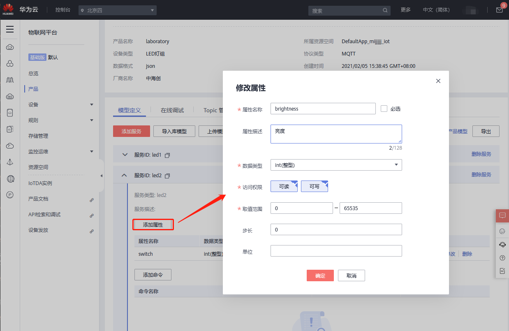

# 云平台

## 阿里云iot in


        阿里云iot in节点用于将采集到的数据上传阿里云平台。

### 一、节点介绍
#### 节点外观


#### 节点属性
+ **产品Key** | 字符串 输入ProductKey标识
+ **设备名称** | 字符串 输入DeviceName标识
+ **设备密钥** | 字符串 输入DeviceSecret标识
+ **地域** | 字符串 cn-shanghai

### 二、示例
        示例中包含个别配置字段无法保存，请自行根据现实情况配置。示例中教程可以通过拷贝示例代码实现快速复用，在新建的流程中点击界面右侧 **菜单栏-导入-剪贴板** ，在文本框中粘贴下面代码后点击确定，即可快速复用。

#### 数据上传
        用阿里云iot in节点对采集数据进行上传。

        连接示意图如下，将温湿度数据上传到阿里云。


        我们打开阿里云平台，创建完产品和设备后会有三个唯一标识，如下图。


        回到海创微联，打开阿里云iot in，输入三个唯一标识，点击部署，如下图。


        然后我们就能在阿里云平台的运行状态中看到上传的数据了。


示例代码：

```plain
[{"id":"eb26b167.e06e9","type":"inject","z":"1d40d649.042bfa","name":"","topic":"","payload":"","payloadType":"date","repeat":"30","crontab":"","once":false,"onceDelay":0.1,"x":155,"y":340,"wires":[["d57d8456.733d78"]]},{"id":"d57d8456.733d78","type":"iot-modbus","z":"1d40d649.042bfa","name":"温湿度","server":"66cafcba.d9e4e4","fc":"HoldingRegister","columns":[{"Key":"CurrentTemperature","Label":"温度","UnitId":"1","Address":"0","Quantity":"1","ValueType":"Int16BE","Arithmetic":"%s/100"},{"Key":"CurrentHumidity","Label":"湿度","UnitId":"1","Address":"1","Quantity":"1","ValueType":"Int16BE","Arithmetic":"%s/100"}],"x":275,"y":340,"wires":[["f1435f78.ea5fa"]]},{"id":"3b3e8d28.6da492","type":"debug","z":"1d40d649.042bfa","name":"温湿度","active":false,"tosidebar":true,"console":false,"tostatus":false,"complete":"payload","x":515,"y":340,"wires":[]},{"id":"f1435f78.ea5fa","type":"aliyun-iot","z":"1d40d649.042bfa","productKey":"","deviceName":"","deviceSecret":"","regionId":"","x":395,"y":340,"wires":[["3b3e8d28.6da492"]]},{"id":"66cafcba.d9e4e4","type":"iot-modbus-client","z":"","name":"","clienttype":"Modbus-TCP","host":"192.168.7.143","post":"4196","tcptype":"Telnet","serialport":"COM1","serialtype":"RTU-Buffered","baudrate":"9600","databits":"8","stopbits":"1","parity":"None","unitid":"1","timeout":"2000","sleep":"200","showActivity":false}]
```

---

## 阿里云iot out


阿里云iot out节点用于将返回阿里云平台采集的数据。

### 节点介绍
#### 节点外观


#### 节点属性
+ **产品Key** | 字符串 输入ProductKey标识
+ **设备名称** | 字符串 输入DeviceName标识
+ **设备密钥** | 字符串 输入DeviceSecret标识
+ **地域** | 字符串 cn-shanghai

---

## 华为云iot in


节点用于将设备采集到的数据上传至华为云平台。

### 一、节点介绍


#### 节点外观


#### 节点属性


+ **名称** | 字符串 输入控件名称
+ **设备配置** | 输入设备名称、设备唯一ID标识、设备密匙以及接入平台的域名与端口号
+ **模式** | 选择数据传输模式
+ **qos** | （服务质量）用于为不同的流量提供不同的优先级，以控制延迟和抖动，并降低丢包率。当网络过载或拥塞时，QoS可以确保关键业务流量的正常传输
+ **服务ID** | 设备服务ID，需要在产品创建成功后进行模型定义，增加数据采集类型属性。


### 二、示例


     示例中包含个别配置字段无法保存，请自行根据现实情况配置。示例中教程可以通过拷贝示例代码实现快速复用，在新建的流程中点击界面右侧 **菜单栏-导入-剪贴板** ，在文本框中粘贴下面代码后点击确定，即可快速复用。


#### 数据上传


     用华为云iot input节点对采集数据进行上传。


     连接示意图如下，将灯光采集数据上传到华为云平台。


平台创建产品：


创建成功后提示创建产品成功，接下来便是定义设备模型以及添加和调试设备。


定义模型，创建服务ID，添加设备属性：


属性添加





添加属性完成


添加设备


添加设备成功后提示创建设备成功


得到设备ID以及密匙,该设备ID以及密匙将用于部署配置边缘网关采集控制系统中的华为云控件


配置域名和端口


填入前面设置的服务ID


配置完成后采集控制系统点击部署


即可看到设备在线


配置输出function函数，通过定时器触发使之输出灯的属性值


点击定时器触发，然后我们就能在阿里云平台的运行状态中看到上传的数据了。


示例代码：


[{"id":"6053634d.a4ff4c","type":"huawei-iot-out","z":"5ff8e90b.6a06a8","name":"实验室灯组","qos":"0","mode":"report","services":"led1","broker":"c958c532.0b6938","x":755,"y":260,"wires":[]},{"id":"c958c532.0b6938","type":"huawei-iot-broker","z":"","name":"实验室灯组1","broker":"a1601518d3.iot-mqtts.cn-north-4.myhuaweicloud.com","port":"1883"}]

## **华为云iot out**
****

华为云iot out节点用于将返回华为云平台采集的数据。


#### 节点外观


#### 节点属性


+ **名称** | 字符串 输入控件名称
+ **设备配置** | 输入设备名称、设备唯一ID标识、设备密匙以及接入平台的域名与端口号
+ **模式** | 选择数据传输模式
+ **qos** | （服务质量）用于为不同的流量提供不同的优先级，以控制延迟和抖动，并降低丢包率。当网络过载或拥塞时，QoS可以确保关键业务流量的正常传输
+ **服务ID** | 设备服务ID，需要在产品创建成功后进行模型定义，增加数据采集类型属性。


> 更新: 2024-03-21 14:18:43  
> 原文: <https://www.yuque.com/iot-fast/ckyq/ece60s>