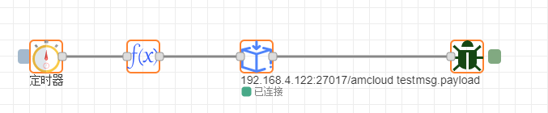
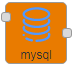

# 存储

## 文件格式
        文件格式节点用于读取文件内容并输出。

### 一、节点介绍
#### 节点外观


#### 节点属性
+ **文件名** | 填写读取文件的路径
+ **输出** | 输出的类型（一个utf8字符串/每行一条信息/一个Buffer对象/一个Buffer流）
+ **名称** | 字符串 用于显示节点名称

**输入消息属性**

+ **filename** | 如果未在节点中配置，则此属性将设置为要读取的文件名

**输出消息属性**

+ **payload** | 文件的内容，为字符串或二进制缓冲区
+ **filename** | 如果未在节点中配置，则此属性设置为要读取的文件的名称
+ **error** | 如果在节点中启用，当节点遇到读取文件的错误时，它将发送no消息

### 二、示例
        示例中包含个别配置字段无法保存，请自行根据现实情况配置。示例中教程可以通过拷贝示例代码实现快速复用，在新建的流程中点击界面右侧 **菜单栏-导入-剪贴板** ，在文本框中粘贴下面代码后点击确定，即可快速复用。

#### 数据的储存和读取
        用文件节点存储和读取数据。

        连接示意图如下，文件格式节点用于读取数据，文件节点用于写入存储数据。


        文件节点配置如下，文件名写入要存储数据的位置，勾选创建目录，此流中的定时器输出数字1（上面那个定时器）。


        文件格式节点配置如下，填写要读取的文件位置，输出字符串，此流中的定时器输出为时间戳（下面那个）。


        点击第一条流的定时器，写入数据并存储在文件中，这里点击了3次，存储了3条信息，调试界面如下。


        点击第二条流的定时器，调试界面如下，读取文件中的数据3个1。


示例代码：

```plain
[{"id":"8c0010e8.9851","type":"tab","label":"流程1","disabled":false,"info":""},{"id":"c5cd1cd4.5333","type":"file in","z":"8c0010e8.9851","name":"","filename":"\\Program Files\\HC-IIoT\\新建文件夹\\文件","format":"utf8","chunk":false,"sendError":true,"x":354.5,"y":463,"wires":[["8a48dedc.51427"]]},{"id":"8a48dedc.51427","type":"debug","z":"8c0010e8.9851","name":"读取","active":true,"tosidebar":true,"console":false,"tostatus":false,"complete":"payload","x":679.5,"y":463,"wires":[]},{"id":"8b52f562.8ee5d8","type":"inject","z":"8c0010e8.9851","name":"","topic":"","payload":"","payloadType":"date","repeat":"","crontab":"","once":false,"onceDelay":0.1,"x":208.5,"y":463,"wires":[["c5cd1cd4.5333"]]},{"id":"da514a78.c03138","type":"file","z":"8c0010e8.9851","name":"","filename":"\\Program Files\\HC-IIoT\\新建文件夹\\文件","appendNewline":true,"createDir":true,"overwriteFile":"false","x":354.5,"y":348,"wires":[["5139d87e.4b5e88"]]},{"id":"5139d87e.4b5e88","type":"debug","z":"8c0010e8.9851","name":"存储","active":true,"tosidebar":true,"console":false,"tostatus":false,"complete":"payload","x":681.5,"y":348,"wires":[]},{"id":"c6ac93db.111cf","type":"inject","z":"8c0010e8.9851","name":"","topic":"","payload":"1","payloadType":"num","repeat":"","crontab":"","once":false,"onceDelay":0.1,"x":206,"y":348,"wires":[["da514a78.c03138"]]}]
```

---

## 文件
        文件节点用于将内容写入存储到文件中，或者替换删除文件。

### 一、节点介绍
#### 节点外观


#### 节点属性
+ **文件名** | 填写写入文件的路径，如果不存在可勾选创建。
+ **行为** | 对目标文件有三种行为
    - **追加至文件** | 下一条消息会跟在前一条后面
    - **复写文件** | 下一条消息会覆盖前面的所有消息
    - **删除文件** | 删除文件
+ **名称** | 字符串 用于显示节点名称

**输入消息属性**

+ **filename** | 如果未在节点中配置，则此属性将设置为要读取的文件名

### 二、示例
        示例中包含个别配置字段无法保存，请自行根据现实情况配置。示例中教程可以通过拷贝示例代码实现快速复用，在新建的流程中点击界面右侧 **菜单栏-导入-剪贴板** ，在文本框中粘贴下面代码后点击确定，即可快速复用。

#### 数据的储存和读取
        用文件节点存储和读取数据。

        连接示意图如下，文件格式节点用于读取数据，文件节点用于写入存储数据。


        文件节点配置如下，文件名写入要存储数据的位置，勾选创建目录，此流中的定时器输出数字1（上面那个定时器）。


        文件格式节点配置如下，填写要读取的文件位置，输出字符串，此流中的定时器输出为时间戳（下面那个）。


        点击第一条流的定时器，写入数据并存储在文件中，这里点击了3次，存储了3条信息，调试界面如下。


        点击第二条流的定时器，调试界面如下，读取文件中的数据3个1。


示例代码：

```plain
[{"id":"8c0010e8.9851","type":"tab","label":"流程1","disabled":false,"info":""},{"id":"c5cd1cd4.5333","type":"file in","z":"8c0010e8.9851","name":"","filename":"\\Program Files\\HC-IIoT\\新建文件夹\\文件","format":"utf8","chunk":false,"sendError":true,"x":354.5,"y":463,"wires":[["8a48dedc.51427"]]},{"id":"8a48dedc.51427","type":"debug","z":"8c0010e8.9851","name":"读取","active":true,"tosidebar":true,"console":false,"tostatus":false,"complete":"payload","x":679.5,"y":463,"wires":[]},{"id":"8b52f562.8ee5d8","type":"inject","z":"8c0010e8.9851","name":"","topic":"","payload":"","payloadType":"date","repeat":"","crontab":"","once":false,"onceDelay":0.1,"x":208.5,"y":463,"wires":[["c5cd1cd4.5333"]]},{"id":"da514a78.c03138","type":"file","z":"8c0010e8.9851","name":"","filename":"\\Program Files\\HC-IIoT\\新建文件夹\\文件","appendNewline":true,"createDir":true,"overwriteFile":"false","x":354.5,"y":348,"wires":[["5139d87e.4b5e88"]]},{"id":"5139d87e.4b5e88","type":"debug","z":"8c0010e8.9851","name":"存储","active":true,"tosidebar":true,"console":false,"tostatus":false,"complete":"payload","x":681.5,"y":348,"wires":[]},{"id":"c6ac93db.111cf","type":"inject","z":"8c0010e8.9851","name":"","topic":"","payload":"1","payloadType":"num","repeat":"","crontab":"","once":false,"onceDelay":0.1,"x":206,"y":348,"wires":[["da514a78.c03138"]]}]
```

---

## mongodb
        一个简单的MongoDB输出节点。可以操纵选定的集合,对MongoDB数据库进行查询、插入数据

### 一、节点介绍
#### 节点外观


### 控件属性
+ **服务器** 配置MongoDB数据库连接配置
    - **地址** |`字符串`  连接的MongoDB数据库ip地址
    - **端口** |`数字`  连接的MongoDB数据库端口
    - **数据库** |`字符串` 连接的MongoDB数据库库名
    - **用户** |`字符串` 数据库用户名
    - **密码** |`字符串` 数据库密码
    - **名称** |`字符串` 用于显示配置的服务器名称
+ **集合** |`字符串` 要操作的MongoDB数据库的集合名，会被消息`msg.collection`覆盖
+ **操作** 配置MongoDB数据库的操作模式
    - **查询** 查询MongoDB数据库配置项
    - **统计** 查询集合的个数或者`msg.payload`的查询结果统计
    - **集合** 作为管道数组提供对聚合管道的访问，
    - **保存** 将更新现有对象或插入新对象（如果尚不存在）
    - **新增** 插入一个新对象
    - **更新** 将修改现有的一个或多个对象。选择要更新的对象，使用`msg.query`查询，使用`msg.payload`更新。如果`msg.query._id`是一个有效的mongo ObjectId字符串，它将被转换为ObjectId类型。如果对象不存在，则可以添加对象或更新多个对象。
    - **删除** 将删除与`msg.payload`中传入的查询匹配的对象。空白查询将被删除_集合中的所有对象_。
+ **名称** 工作区显示节点名称

#### 输入消息属性
+ **msg.payload** |`对象` 作为查询语句
+ **msg.projection** |`对象` 使用投影操作符指定需要返回的键
+ **msg.sort** |`对象` 对查询结果排序
+ **msg.limit** |`数字` 限制返回文档长度
+ **msg.skip** |`数字` 取查询结果开始位置
+ **msg.collection** |`字符串` 设置查询集合名，会覆盖节点属性**集合**的值

#### 输出消息属性
+ **msg.payload** | [`对象`|`数字`] 返回操作结果
    - 当**操作**为`统计` |`数字`  返回查询结果统计行数
    - 当**操作**为`新增` |`对象`
        * **result** |`对象`
            + **ok** | `数字`  操作结果，`0`失败，`1`成功
            + **n** |`数字` 受影响行数
        * **ops** |`数组` 操作行数的执行结果
            + **status** |`字符串` 该行执行结果'ok'为成功
            + **_id** |`字符串` 新增行数的_id
        * **insertedCount** |`数字` 插入计数
    - 当**操作**为`新增` |`数组` 返回查询结果行集合
    - 当**操作**为`更新` |`对象` 返回操作结果
        * **n** |`数字` 受影响行数
        * **ok** |`数字` 操作结果`0` 失败，`1`成功
        * **nModified** |`数字` 更新行数

### 二、示例
        示例中包含个别配置字段无法保存，请自行根据现实情况配置。示例中教程可以通过拷贝示例代码实现快速复用，在新建的流程中点击界面右侧 **菜单栏**-**导入**-**剪贴板**，在文本框中粘贴下面代码后点击确定，即可快速复用

1. 案例一：插入数据  示例代码：

```plain
[{"id":"89c79cc9.b691a","type":"mongodb-node","z":"58e92d1f.7f2124","mongodb":"d0491b4a.757df8","name":"","collection":"test","operation":"insert","upsert":false,"multi":false,"x":335,"y":240,"wires":[["c3e1841a.6e0ce8"]]},{"id":"e5b2cdbf.c36bd","type":"inject","z":"58e92d1f.7f2124","name":"","topic":"","payload":"","payloadType":"date","repeat":"","crontab":"","once":false,"onceDelay":0.1,"x":75,"y":240,"wires":[["78c6d1f5.ca756"]]},{"id":"c3e1841a.6e0ce8","type":"debug","z":"58e92d1f.7f2124","name":"","active":true,"tosidebar":true,"console":false,"tostatus":false,"complete":"payload","x":595,"y":240,"wires":[]},{"id":"78c6d1f5.ca756","type":"function","z":"58e92d1f.7f2124","name":"","func":"msg.payload={status:'ok'}\nreturn msg;","outputs":1,"noerr":0,"x":195,"y":240,"wires":[["89c79cc9.b691a"]]},{"id":"d0491b4a.757df8","type":"mongodb-config","z":"","hostname":"192.168.4.122","port":"27017","db":"amcloud","name":""}]
```

1.  连接示意图：  
  
 调试结果：  

2. 案例二：查询数据(查询前10条数据，限制返回键为status，以键status升序)  示例代码：

```plain
[{"id":"89c79cc9.b691a","type":"mongodb-node","z":"58e92d1f.7f2124","mongodb":"d0491b4a.757df8","name":"","collection":"test","operation":"find","upsert":false,"multi":false,"x":335,"y":240,"wires":[["c3e1841a.6e0ce8"]]},{"id":"e5b2cdbf.c36bd","type":"inject","z":"58e92d1f.7f2124","name":"","topic":"","payload":"","payloadType":"date","repeat":"","crontab":"","once":false,"onceDelay":0.1,"x":75,"y":240,"wires":[["78c6d1f5.ca756"]]},{"id":"c3e1841a.6e0ce8","type":"debug","z":"58e92d1f.7f2124","name":"","active":true,"tosidebar":true,"console":false,"tostatus":false,"complete":"payload","x":595,"y":240,"wires":[]},{"id":"78c6d1f5.ca756","type":"function","z":"58e92d1f.7f2124","name":"","func":"msg={\n    collection:'test',\n    payload:{status:'ok'},\n    projection:{'status':1},\n    sort:{stayus:1},\n    limit:10,\n    skip:0\n}\nreturn msg;","outputs":1,"noerr":0,"x":195,"y":240,"wires":[["89c79cc9.b691a"]]},{"id":"d0491b4a.757df8","type":"mongodb-config","z":"","hostname":"192.168.4.122","port":"27017","db":"amcloud","name":""}]
```

1.  连接示意图：  
  
  调试结果：  

2. 案例三：更新数据(找不到匹配项，则创建一个新文档,更新所有匹配的文档)  示例代码：

```plain
[{"id":"89c79cc9.b691a","type":"mongodb-node","z":"58e92d1f.7f2124","mongodb":"d0491b4a.757df8","name":"","collection":"test","operation":"update","upsert":true,"multi":true,"x":335,"y":240,"wires":[["c3e1841a.6e0ce8"]]},{"id":"e5b2cdbf.c36bd","type":"inject","z":"58e92d1f.7f2124","name":"","topic":"","payload":"","payloadType":"date","repeat":"","crontab":"","once":false,"onceDelay":0.1,"x":75,"y":240,"wires":[["78c6d1f5.ca756"]]},{"id":"c3e1841a.6e0ce8","type":"debug","z":"58e92d1f.7f2124","name":"","active":true,"tosidebar":true,"console":false,"tostatus":false,"complete":"payload","x":595,"y":240,"wires":[]},{"id":"78c6d1f5.ca756","type":"function","z":"58e92d1f.7f2124","name":"","func":"msg={\n    collection:'test',\n    payload:{\"$set\":{na:'1'}},\n    query:{status:'ok'}\n}\nreturn msg;","outputs":1,"noerr":0,"x":195,"y":240,"wires":[["89c79cc9.b691a"]]},{"id":"d0491b4a.757df8","type":"mongodb-config","z":"","hostname":"192.168.4.122","port":"27017","db":"amcloud","name":""}]
```

1.  连接示意图：  
  
 调试结果：  


---

## Influxdb
---

## mysql
允许对MySQL数据库进行增、删、改、查的操作。

### 一、节点介绍
#### 节点外观


#### 控件属性
+ **服务器** 配置mysql数据库连接配置
    - **地址** |`字符串`  连接的mysql数据库ip地址
    - **端口** |`数字`  连接的mysql数据库端口
    - **用户** |`字符串` 数据库用户名
    - **密码** |`字符串` 数据库密码
    - **数据库** |`字符串` 连接的mysql数据库库名
    - **时区** |`字符串` 用来设置mysql数据库时区
+ **名称** |`字符串` 工作区显示节点名称

#### 输入消息属性
+ **msg.topic** |`对象` sql语句

#### 输出消息属性
+ **msg.payload** |`数组` 返回操作结果

---

## TDengine
TDengine数据库客户端控件。

### 一、节点介绍
#### 节点外观


#### 节点属性
+ **地址** |`字符串`  连接的TDengine数据库ip地址
+ **端口** |`数字`  连接的TDengine数据库端口
+ **用户** |`字符串` 数据库用户名
+ **密码** |`字符串` 数据库密码

#### 输入消息属性
+ **msg.payload** | `字符串` sql语句

#### 输出消息属性
+ **msg.payload** | `数组` 返回操作结果

---

## mssql
        允许对SQLServer数据库进行增、删、改、查的操作。

### 一、节点介绍
#### 节点外观


#### 节点属性
+ **服务器** 配置mssql数据库连接配置
    - **名称** |`字符串` 配置信息名称
    - **地址** |`字符串`  连接的mssql数据库ip地址，端口用`,`隔开,例如：192.168.7.45,1433
    - **用户名** |`字符串` 数据库用户名
    - **密码** |`字符串` 数据库密码
    - **域** |`字符串` 使用windows身份登录会有一个域账号。注意：SQL Server身份验证不需要填写
    - **数据库** |`字符串` 连接的mssql数据库库名
+ **名称** |`字符串` 工作区显示节点名称
+ **语句** |`字符串` sql语句，例如：select * from D_MESPACK_GD

#### 输出消息属性
+ **msg.payload** |`数组` 返回操作结果


> 更新: 2024-03-21 14:18:44  
> 原文: <https://www.yuque.com/iot-fast/ckyq/ge4kh9>