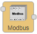
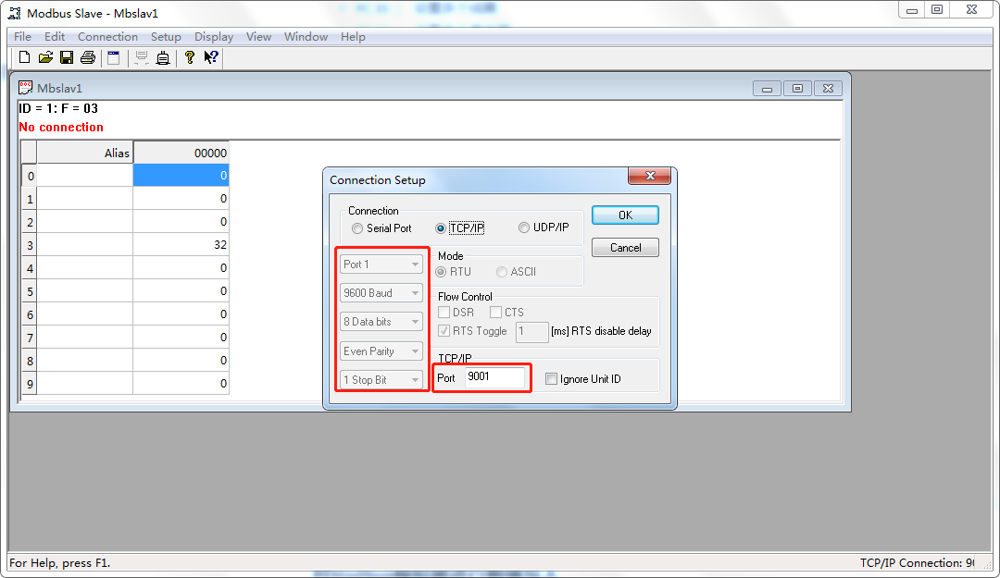
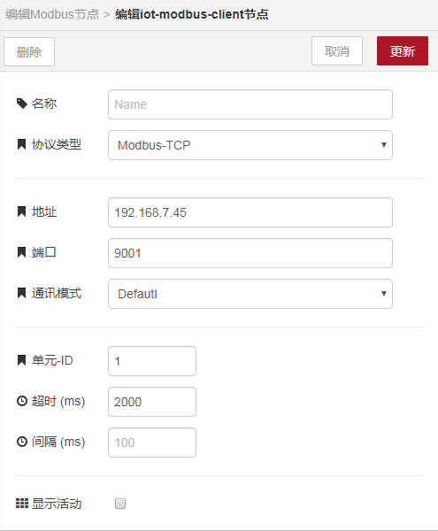
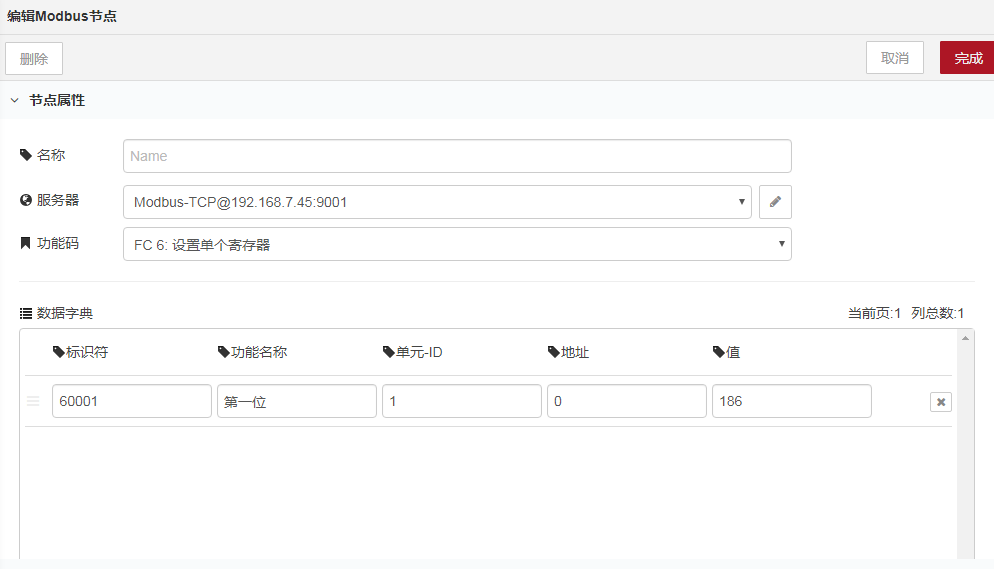
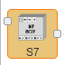

# 控制引擎

## ModbusCtrl
        ModbusCtrl是modbus写入的节点。

### 一、节点介绍
#### 节点外观

#### 节点属性
+ **名称** | 字符串 用于显示节点名称
+ **服务器** | 配置服务器信息
    - **名称** | 用于限制服务器名
    - **协议类型** | 限制协议类型
        * **Modbus-TCP** | ModbusTCP类型
            + **地址** | 服务器的IP地址
            + **端口** | 服务器的IP端口
            + **通讯模式** | 选择服务器的通讯模式，有Defautl、RTU-Buffered、Telnet、C701四种模式
        * **Modbus-Serial** | Modbus串口类型
            + **串行端口** | 设备挂载的端口地址
            + **通讯模式** | 设置与挂载的设备的通讯模式，有RTU-Buffered、RTU、ASCII三种模式
            + **波特率** | 设置挂载的设备的波特率
        * **Modbus-SerialExpert** | 对Modbus串口类型进行扩展
            + **串行端口** | 设备挂载的端口地址
            + **通讯模式** | 与挂载设备的通讯模式，有RTU-Buffered、RTU、ASCII三种模式
            + **波特率** | 挂载设备的波特率
            + **数据位** | 挂载设备的数据位
            + **停止位** | 挂载设备的停止位
            + **奇偶检验** | 挂载设备的校验方式
    - **单元-ID** | 设备号
    - **超时** | 设备在设置时间内无响应，返回超时
    - **间隔** | 对设备进行高速连续性发包时，用于设置设备的等待时间
+ **功能码** | 用于标明一个Modbus信息帧的用途
    - **FC 5** | 设置单个线圈
    - **FC 6** | 设置单个寄存器
    - **FC 15** | 设置多个线圈
    - **FC 16** | 设置多个寄存器
+ **标识符** | 上环节msg.payload对象赋值的key名
+ **功能名称** | 备注
+ **单元-ID** | 设备号（注：如果这里没有设置，默认服务器配置里的单元-ID）
+ **地址** | 写入设备的Modbus地址
+ **值** | 写入的值  
**提示**：支持十进制与十六进制，十六进制格式： 0x00 ，批量写入格式： [0,1,2]

**输出消息属性**

+ **payload** | 默认输出消息msg.payload
    - **success** | 提示写入操作是否成功（true/false）
    - **msg** | 当success=true，msg输出操作成功；当success=flase，msg输出错误原因

### 二、示例
        示例中包含个别配置字段无法保存，请自行根据现实情况配置。示例中教程可以通过拷贝示例代码实现快速复用，在新建的流程中点击界面右侧 **菜单栏-导入-剪贴板** ，在文本框中粘贴下面代码后点击确定，即可快速复用。

#### 对Modbus模拟器进行数值写入
        首先打开Modbus的模拟器Moudbus Slave，设置好波特率、校验位、停止位、单元ID和功能码。

        然后在海创微联上拉出ModbusCtrl控制，配置好服务器内容，功能码和数据字典内的内容。

---

## S7-Write
        S7-Write是西门子PLC的写入节点。

### 一、节点介绍
#### 节点外观

#### 节点属性
+ **名称** | 字符串 用于显示节点名称
+ **服务器** | 配置服务器信息
    - **名称** | 用于限制服务器名
    - **通讯方式** | 服务器连接的方式
    - **地址** | 服务器的IP地址
    - **端口** | 服务器的IP端口
    - **模式** | 选择服务器的通讯模式，有TSAP、Rack-Slot两种模式
+ **标识符** | 上环节msg.payload对象赋值的key名
+ **功能名称** | 备注
+ **内存域** | PLC内存区
+ **地址** | 内存区读取地址
+ **数据类型** | 读取的地址数据类型，如bit、byte、int等
+ **值** | 写入的值

**输出消息属性**

+ **payload** | 默认输出消息msg.payload

> 更新: 2024-03-21 14:18:47  
> 原文: <https://www.yuque.com/iot-fast/ckyq/gkotie>