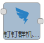
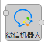

# 警告

## 微信消息模板
微信消息模板基于微信公众号消息接口实现，能把消息推送到微信公众号。

### 一、节点介绍
#### 节点外观


#### 节点属性
+ **名称** |`字符串` 工作区显示节点名称
+ **accessToken** |`字符串`  钉钉机器人Hook地址，由此地址通讯机器人

#### 输入消息属性
+ **msg.accessToken** | `字符串` 微信公众号秘钥，可通过节点accessToken设置，也可通过上环节msg.accessToken输入。
+ **msg.payload** | `对象` 给公众号发包的格式   msg.payload =    {

```plain
"touser":"ouEYt2Ek3aJhU1J6LjfflqPdZD_o",
  "template_id":"WVVOB54mt0XYRNbC5-ONmDl_AIeKpxh_0VSzLYLjk8k",
  "data":{
    "first": {
        "value":"测试！",
        "color":"#173177"
    },
    "keyword1":{
        "value":"设备1",
        "color":"#173177"
    },
    "keyword2": {
        "value":"1",
        "color":"#173177"
    },
    "keyword3": {
        "value":"true",
        "color":"#173177"
    },
    "remark":{
        "value":"测试报警！",
        "color":"#173177"
    }
  }
```

+   }

#### 输出消息属性
+ **msg.payload** | `数组` 返回操作结果

---

## 微信机器人
        微信机器人基于机器人webhook实现，能把消息推送到微信群里。

### 一、节点介绍
#### 节点外观


#### 节点属性
+ **名称** |`字符串` 工作区显示节点名称
+ **Hook地址** |`字符串`  企业微信机器人Hook地址，由此地址通讯机器人

#### 输入消息属性
+ **msg.payload** | `对象` 给机器人发包的格式  
  msg.payload =    {

```plain
"msgtype": "text",
  "text": {
      "content": "广州今日天气：29度，大部分多云，降雨概率：60%",
      "mentioned_list":["wangqing","@all"],
      "mentioned_mobile_list":["13800001111","@all"]
  }
```

+   }

#### 输出消息属性
+ **msg.payload** | `数组` 返回操作结果

---

## 钉钉群机器人
        钉钉群机器人基于钉钉自定义机器人webhook实现，能把消息推送到钉钉机器人里。

### 一、节点介绍
#### 节点外观


#### 节点属性
+ **名称** |`字符串` 工作区显示节点名称
+ **Hook地址** |`字符串`  钉钉机器人Hook地址，由此地址通讯机器人

#### 输入消息属性
+ **msg.payload** | `对象` 给机器人发包的格式  
  msg.payload =    {

```plain
"msgtype": "text", 
  "text": {
      "content": "我就是我, 是不一样的烟火"
  },
```

+   "at":{

```plain
"atMobiles": [
      "电话号码"
  ], 
  "isAtAll": false 
  }
```

+   }

#### 输出消息属性
+ **msg.payload** | `数组` 返回操作结果


> 更新: 2024-03-21 14:18:45  
> 原文: <https://www.yuque.com/iot-fast/ckyq/rlxqtq>