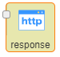

# 输出

## 调试器
        用于对其他节点的输出在调试窗口进行显示，默认显示msg.payload。

可以根据需要折叠和扩展JavaScript对象和数组，缓冲区对象可以显示为原始数据或尽可能显示为字符串。

除了每条消息，调试侧栏还包括有关接收消息的时间，发送消息的节点以及消息类型的信息，单击源节点ID将显示工作空间中的该节点。

        节点上的按钮可用于启用或禁用其输出，建议禁用或删除任何未使用的调试器节点。

### 一、节点介绍
#### 节点外观


#### 节点属性
+ **输出** | 选择只显示msg.payload或是完整信息
    - **msg.payload** | 默认输出payload
    - **完整信息** | 显示被调试节点的完整信息
+ **目标** | 对调试窗口、Console、节点状态 （32位字符） 进行勾选。
+ **名称** | 字符串 用于显示节点名称

**输入消息属性**

        根据被调试节点决定，输入什么属性就会在调试窗口显示什么属性，默认显示为msg.payload。

### 二、示例
        示例中包含个别配置字段无法保存，请自行根据现实情况配置。示例中教程可以通过拷贝示例代码实现快速复用，在新建的流程中点击界面右侧 **菜单栏-导入-剪贴板** ，在文本框中粘贴下面代码后点击确定，即可快速复用。

#### 显示节点输出
        用调试器节点对定时器的输出进行显示。

        连接示意图如下，定时器为手动注入时间戳。


        调试器节点配置如下，输出选择msg.payload。


        点击定时器，调试结果如下，在调试窗口显示时间戳。


示例代码：

```plain
[{"id":"e99dc73.eb9ab38","type":"tab","label":"流程1","disabled":false,"info":""},{"id":"31e722ac.994dae","type":"debug","z":"e99dc73.eb9ab38","name":"","active":true,"tosidebar":true,"console":false,"tostatus":false,"complete":"payload","x":457.5,"y":351,"wires":[]},{"id":"716a755b.65231c","type":"inject","z":"e99dc73.eb9ab38","name":"","topic":"","payload":"","payloadType":"date","repeat":"","crontab":"","once":false,"onceDelay":0.1,"x":285.5,"y":350,"wires":[["31e722ac.994dae"]]}]
```

---

## Link
        Link out节点用于在流之间创建虚拟连线，它和link in节点一起使用，该节点可以连接到任意link in节点，连接后，它们就是连接在一起的。

### 一、节点介绍
#### 节点外观


#### 节点属性
+ **名称** | 字符串 用于显示节点名称
+ **节点名称** | 对所有的link in节点进行选择连接

**输入消息属性**

link out节点输入消息的属性为与之相连节点的输出属性。

### 二、示例
        示例中包含个别配置字段无法保存，请自行根据现实情况配置。示例中教程可以通过拷贝示例代码实现快速复用，在新建的流程中点击界面右侧 **菜单栏-导入-剪贴板** ，在文本框中粘贴下面代码后点击确定，即可快速复用。

#### 虚拟连接
        用link节点进行虚拟连接。

        连接示意图如下，定时器发出时间戳给link out节点，link in节点连接此link out节点，便能在调试窗口中看到时间戳了。


        选中link节点可以看到虚拟连线，如下图。


        link节点配置如下，在link in节点名称中选择要进行连接的link out节点，或者在link out节点中选择要进行连接的link in节点从而建立连线。


        点击定时器，调试结果如下，调试窗口显示时间戳。


示例代码：

```plain
[{"id":"e99dc73.eb9ab38","type":"tab","label":"流程1","disabled":false,"info":""},{"id":"804ad393.5f8be","type":"link in","z":"e99dc73.eb9ab38","name":"","links":["31c9074d.94b7b8"],"x":293.5,"y":278,"wires":[["ee6113da.ef5a4"]]},{"id":"ee6113da.ef5a4","type":"debug","z":"e99dc73.eb9ab38","name":"","active":true,"tosidebar":true,"console":false,"tostatus":false,"complete":"false","x":495.5,"y":276,"wires":[]},{"id":"31c9074d.94b7b8","type":"link out","z":"e99dc73.eb9ab38","name":"","links":["804ad393.5f8be"],"x":495.5,"y":180,"wires":[]},{"id":"6a02285b.6211f8","type":"inject","z":"e99dc73.eb9ab38","name":"","topic":"","payload":"","payloadType":"date","repeat":"","crontab":"","once":false,"onceDelay":0.1,"x":294.5,"y":181,"wires":[["31c9074d.94b7b8"]]}]
```

---

## Mqtt
        Mqtt out节点用于发布主题，使mqtt in节点订阅，几个mqtt节点（in或out）可以共享相同的代理连接。

### 一、节点介绍
#### 节点外观


#### 节点属性
+ **服务端** | 字符串 用于显示发布主题的服务端地址和端口
    - **名称** | 字符串 用于显示服务端名称
    - **连接** | 填写发布主题的服务端的IP地址以及端口信息
    - **安全** | 设置用户名和密码
    - **Messages** | 发送Messages的主题和内容
+ **主题** | 字符串 填写发布的主题
+ **QoS** | 数字 全称Quality of Service，服务质量等级
    - **0** | level 0：最多一次的传输
    - **1** | level 1：至少一次的传输
    - **2** | level 2：只有一次的传输
+ **名称** | 字符串 用于显示节点名称

**输入消息属性**

+ **payload** | 简单的文本有效负载，但也可以发布二进制缓冲区
+ **topic** | 要发布到的mqtt主题
+ **qos** | 0：最多一次的传输；1：至少一次的传输；2，只有一次的传输
+ **retain** | 设置为true以在代理上保留消息，默认为false

### 二、示例
        示例中包含个别配置字段无法保存，请自行根据现实情况配置。示例中教程可以通过拷贝示例代码实现快速复用，在新建的流程中点击界面右侧 **菜单栏-导入-剪贴板** ，在文本框中粘贴下面代码后点击确定，即可快速复用。

#### 发布和订阅主题
        用mqtt节点进行主题的发布和订阅。

        连接示意图如下，用mqtt out发布主题123，mqtt in订阅主题123。


        mqtt out节点配置如下，填写好发布的服务端地址、端口和主题。


        mqtt in节点配置如下，填写需要订阅主题的服务端地址和端口，QoS选择2，只传输一次。


        点击定时器，调试结果如下，在调试窗口显示定时器发出的时间戳。


示例代码：

```plain
[{"id":"e99dc73.eb9ab38","type":"tab","label":"流程1","disabled":false,"info":""},{"id":"3fc1ad78.f199e2","type":"mqtt in","z":"e99dc73.eb9ab38","name":"","topic":"123","qos":"2","broker":"dfbfb8a8.d989c8","x":359.5,"y":259,"wires":[["52796cbc.79a694"]]},{"id":"ed1447c4.bb8288","type":"mqtt out","z":"e99dc73.eb9ab38","name":"","topic":"123","qos":"","retain":"","broker":"dfbfb8a8.d989c8","x":517.5,"y":172,"wires":[]},{"id":"b609eff2.dc442","type":"inject","z":"e99dc73.eb9ab38","name":"","topic":"","payload":"","payloadType":"date","repeat":"","crontab":"","once":false,"onceDelay":0.1,"x":359.5,"y":173,"wires":[["ed1447c4.bb8288"]]},{"id":"52796cbc.79a694","type":"debug","z":"e99dc73.eb9ab38","name":"","active":true,"tosidebar":true,"console":false,"tostatus":false,"complete":"false","x":517.5,"y":259,"wires":[]},{"id":"dfbfb8a8.d989c8","type":"mqtt-broker","z":"","name":"","broker":"39.107.236.122","port":"1883","clientid":"","usetls":false,"compatmode":true,"keepalive":"60","cleansession":true,"birthTopic":"","birthQos":"0","birthPayload":"","closeTopic":"","closeQos":"0","closePayload":"","willTopic":"","willQos":"0","willPayload":""}]
```

---

## Response
        Http out节点用于将响应发送回从http in节点收到的请求，发送到此节点的消息必须来自http in节点。

### 一、节点介绍
#### 节点外观


#### 节点属性
+ **名称** | 字符串 用于显示节点名称
+ **状态码** | 设置响应状态代码，也可不设置，默认值为200
+ **Header** | 选择添加http标头，也可不添加

**输入消息属性**

+ **payload** | 回应的主体
+ **statusCode** | 如果设置，则将其用作响应状态代码，默认值：200
+ **headers** | 如果设置，则提供要包含在响应中的http标头
+ **cookies** | 如果设置，可用于设置或删除cookie

**细节**

        Cookie handling 该cookies属性必须是名称/值对的对象，该值可以是用于使用默认选项设置cookie值的字符串，也可以是选项对象。

        以下示例设置两个cookie - 一个name使用值调用nick，另一个调用session值为，1234并且到期时间设置为15分钟。

```plain
msg.cookies = {
    name: 'nick',
    session: {
        value: '1234',
        maxAge: 900000
    }
}
```

有效选项包括：

    1. domain - （String）cookie的域名
    2. expires - （Date）GMT的到期日。如果未指定或设置为0，则创建会话cookie
    3. maxAge - （String）到期日期相对于当前时间（以毫秒为单位）
    4. path - （String）cookie的路径。默认为/
    5. value - (String) 用于cookie的值
    6. 要删除cookie，请将其设置value为null

### 二、示例
        示例中包含个别配置字段无法保存，请自行根据现实情况配置。示例中教程可以通过拷贝示例代码实现快速复用，在新建的流程中点击界面右侧 **菜单栏-导入-剪贴板** ，在文本框中粘贴下面代码后点击确定，即可快速复用。

#### 创建端点请求并返回
        连接示意图如下，用http in节点创建端点、http requset节点发出请求、http out节点返回。


        在函数节点中给payload赋值，值为123。


        http in节点配置如下，请求方式选择get，url中自定义填写创建的端点，这里用/http。


        http requset节点配置如下，请求方式选择get，url中填写请求的网址，末尾/http就是前面创建的端点。


        http out节点不需要配置。

        点击定时器，调试结果如下，payload=123。


        打开网址显示如下，文本123。


示例代码：

```plain
[{"id":"e99dc73.eb9ab38","type":"tab","label":"流程1","disabled":false,"info":""},{"id":"f98a9640.251f48","type":"http in","z":"e99dc73.eb9ab38","name":"","url":"/http","method":"get","upload":false,"swaggerDoc":"","x":483.5,"y":96,"wires":[["629d9fa4.990ad"]]},{"id":"66061d71.239c94","type":"http response","z":"e99dc73.eb9ab38","name":"","statusCode":"","headers":{},"x":748.5,"y":96,"wires":[]},{"id":"629d9fa4.990ad","type":"function","z":"e99dc73.eb9ab38","name":"","func":"msg.payload=\"123\"\nreturn msg;","outputs":1,"noerr":0,"x":621.5,"y":96,"wires":[["66061d71.239c94"]]},{"id":"e14e9b11.b78cb8","type":"debug","z":"e99dc73.eb9ab38","name":"","active":true,"tosidebar":true,"console":false,"tostatus":false,"complete":"true","x":743.5,"y":190,"wires":[]},{"id":"92116bfb.87a668","type":"http request","z":"e99dc73.eb9ab38","name":"","method":"GET","ret":"txt","url":"http://192./http","tls":"","x":619.5,"y":190,"wires":[["e14e9b11.b78cb8"]]},{"id":"78443f03.7c0fe","type":"inject","z":"e99dc73.eb9ab38","name":"","topic":"","payload":"","payloadType":"date","repeat":"","crontab":"","once":false,"onceDelay":0.1,"x":497.5,"y":190,"wires":[["92116bfb.87a668"]]}]
```

---

## Websocket
        Websocket输出节点，默认情况下，msg.payload将通过websocket发送。

### 一、节点介绍
#### 节点外观


#### 节点属性
+ **类型** | 选择类型
    - **监听** | 填写监听路径，选择有效载荷或是完整信息
    - **连接** | 填写地址，以 **ws://** 打头
+ **名称** | 字符串 用于显示节点名称

**输入消息属性**

+ **payload** | 从websocket接收的数据或是发送的数据

### 二、示例
        示例中包含个别配置字段无法保存，请自行根据现实情况配置。示例中教程可以通过拷贝示例代码实现快速复用，在新建的流程中点击界面右侧 **菜单栏-导入-剪贴板** ，在文本框中粘贴下面代码后点击确定，即可快速复用。

#### 数据传送和接收
        用websocket节点实现数据的传送和接收。

        连接示意图如下，websocket out节点发送数据，websocket in节点获取数据，显示在调试窗口。


        在函数中给给payload赋值，值为123。


        websocket out节点配置如下，类型选择监听，路径设为/ws/http


        websocket in节点配置如下，类型选择连接，url以ws://打头，/ws/http结尾。


        点击定时器，调试结果如下，接收到payload为123。


示例代码：

```plain
[{"id":"e99dc73.eb9ab38","type":"tab","label":"流程1","disabled":false,"info":""},{"id":"d0d4864d.bedd78","type":"websocket in","z":"e99dc73.eb9ab38","name":"","server":"","client":"6b36032d.e02d7c","x":191.5,"y":340,"wires":[["66e5d37f.3201fc"]]},{"id":"c16c1a88.dcd188","type":"websocket out","z":"e99dc73.eb9ab38","name":"","server":"385ef72a.2ddfa8","client":"","x":484.5,"y":241,"wires":[]},{"id":"66e5d37f.3201fc","type":"debug","z":"e99dc73.eb9ab38","name":"","active":true,"tosidebar":true,"console":false,"tostatus":false,"complete":"payload","x":509.5,"y":341,"wires":[]},{"id":"81664412.58fda8","type":"inject","z":"e99dc73.eb9ab38","name":"","topic":"","payload":"","payloadType":"date","repeat":"","crontab":"","once":false,"onceDelay":0.1,"x":236.5,"y":241,"wires":[["48cfefb9.6bfc9"]]},{"id":"48cfefb9.6bfc9","type":"function","z":"e99dc73.eb9ab38","name":"","func":"msg.payload=\"123\"\nreturn msg;","outputs":1,"noerr":0,"x":350.5,"y":241,"wires":[["c16c1a88.dcd188"]]},{"id":"6b36032d.e02d7c","type":"websocket-client","z":"","path":"ws://192./ws/http","tls":"","wholemsg":"false"},{"id":"385ef72a.2ddfa8","type":"websocket-listener","z":"","path":"/ws/http","wholemsg":"false"}]
```

---

## Tcp
Tcp out节点提供tcp输出选择，可以连接到远程TCP端口，接受传入连接，或回复从tcp in节点接收的消息。

### 一、节点介绍
#### 节点外观


#### 节点属性
+ **类型** | 选择返回的类型 
    - **监听** | 只需要填写地址端口
    - **连接** | 需要填写主机地址和端口
    - **响应TCP** | 响应TCP
+ **名称** | 字符串 用于显示节点名称

**输入消息属性**

        仅发送msg.payload，如果msg.payload是包含二进制Base64编码的字符串或数据，在被发送之前，勾选Base64解码选项将使其转换回二进制。

        如果msg._session不存在，则有效负载为发送到所有连接的客户端。

### 二、示例
        示例中包含个别配置字段无法保存，请自行根据现实情况配置。示例中教程可以通过拷贝示例代码实现快速复用，在新建的流程中点击界面右侧 **菜单栏-导入-剪贴板** ，在文本框中粘贴下面代码后点击确定，即可快速复用。

#### 包体的发送和返回
        用tcp节点实现包体的发送和返回。

        连接示意图如下，用tcp请求节点发送一个包体，tcp in节点接收后由tcp out节点返回。


        tcp in节点配置如下，填写好地址和端口，选择字串流Buffer输出。


        对tcp请求节点和tcp out节点配置同样的地址和端口，点击定时器，调试结果如下，输出28位Buffer。


示例代码：

```plain
[{"id":"e99dc73.eb9ab38","type":"tab","label":"流程1","disabled":false,"info":""},{"id":"c6103221.211e1","type":"tcp in","z":"e99dc73.eb9ab38","name":"","server":"client","host":"192.","port":"1880","datamode":"stream","datatype":"buffer","newline":"","topic":"","base64":false,"x":366.5,"y":147,"wires":[["b5561e25.a3b2c"]]},{"id":"b5561e25.a3b2c","type":"tcp out","z":"e99dc73.eb9ab38","host":"192.9","port":"1880","beserver":"client","base64":false,"end":false,"name":"","x":709.5,"y":150,"wires":[]},{"id":"80397524.9314d8","type":"tcp request","z":"e99dc73.eb9ab38","server":"192.","port":"1880","out":"sit","splitc":" ","name":"","x":505.5,"y":250,"wires":[["ba6caf44.429ce"]]},{"id":"4836a80a.173a38","type":"inject","z":"e99dc73.eb9ab38","name":"","topic":"","payload":"","payloadType":"date","repeat":"","crontab":"","once":false,"onceDelay":0.1,"x":352.5,"y":249,"wires":[["80397524.9314d8"]]},{"id":"ba6caf44.429ce","type":"debug","z":"e99dc73.eb9ab38","name":"","active":true,"tosidebar":true,"console":false,"tostatus":false,"complete":"false","x":713.5,"y":250,"wires":[]}]
```

---

## Udp
        Udp out节点用于发送msg.payload到指定的UDP主机和端口，支持组播，如果选择广播，则将地址设置为本地广播IP地址，或者尝试255.255.255.255，这是全局广播地址。

### 一、节点介绍
#### 节点外观


#### 节点属性
+ **发送一个** | 选择发送的类型：udp信息、广播信息或是组播信息到目标端口。
+ **地址** | 填写目标ip地址，ivp4或是ivp6
+ **名称** | 字符串 用于显示节点名称

### 二、示例
        示例中包含个别配置字段无法保存，请自行根据现实情况配置。示例中教程可以通过拷贝示例代码实现快速复用，在新建的流程中点击界面右侧 **菜单栏-导入-剪贴板** ，在文本框中粘贴下面代码后点击确定，即可快速复用。

#### 消息的发送接收
        用udp节点实现消息的发送和接收。

        连接示意图如下，用udp out节点发送一个payload，udp in接收并在调试窗口显示。


        函数节点用于给payload赋值，值为123，如下图。


        udp out节点配置如下，发送一个udp消息，填写好发送到的地址和端口，选择ipv4。


        udp in节点配置如下，填写好对应的端口，使用ipv4，输出选择字符串。


        这样udp in节点就能接收udp out发出的消息了，调试结果如下。


示例代码：

```plain
[{"id":"e99dc73.eb9ab38","type":"tab","label":"流程1","disabled":false,"info":""},{"id":"f8b4a5eb.150618","type":"udp in","z":"e99dc73.eb9ab38","name":"","iface":"","port":"1880","ipv":"udp4","multicast":"false","group":"","datatype":"utf8","x":243.5,"y":366,"wires":[["5e655013.10465"]]},{"id":"7d420667.6dc288","type":"udp out","z":"e99dc73.eb9ab38","name":"","addr":"192.","iface":"","port":"1880","ipv":"udp4","outport":"","base64":false,"multicast":"false","x":498.5,"y":283,"wires":[]},{"id":"8da1a5a9.c64108","type":"inject","z":"e99dc73.eb9ab38","name":"","topic":"","payload":"","payloadType":"date","repeat":"","crontab":"","once":false,"onceDelay":0.1,"x":219.5,"y":283,"wires":[["2aeb3b43.3138c4"]]},{"id":"5e655013.10465","type":"debug","z":"e99dc73.eb9ab38","name":"","active":true,"tosidebar":true,"console":false,"tostatus":false,"complete":"false","x":429.5,"y":365,"wires":[]},{"id":"2aeb3b43.3138c4","type":"function","z":"e99dc73.eb9ab38","name":"","func":"msg.payload=\"123\"\nreturn msg;","outputs":1,"noerr":0,"x":331.5,"y":283,"wires":[["7d420667.6dc288"]]}]
```


> 更新: 2024-03-21 14:18:41  
> 原文: <https://www.yuque.com/iot-fast/ckyq/cqa5vy>