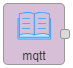

# 通用

## 定时器
        定时器用于手动或者定期对流中注入消息，消息有效负载可以是各种类型，包括字符串，javascript对象或当前时间。

### 一、节点介绍
#### 节点外观


#### 节点属性
+ **内容** | 选择输出消息的类型和内容
    - **flow.** | 输出本流程中的某个路径
    - **global.** | 输出全部流程中的某个路径
    - **文字列** | 字符串 输出文字列消息
    - **数字** | 数字 输出数字消息
    - **布尔** | 布尔值 输出true（真）或false（假）
    - **JOSN** | 对对象赋值输出
    - **二进制流** | 字节值的json数组 编辑器将输入的数值解析为json数组，如果它不是有效的josn，将被视为UTF-8字符串，并被转换为单个字符代码点的数组
    - **时间戳** | 对流输出一次时间戳
    - **env variable** | env 变量
+ **主题** | 字符串 可以选择主题写入
+ **重复** | 使定时器重复输出
    - **无** | 通过单击编辑器中的按钮手动触发节点，也可以配置为每次启动流时注入一次
    - **周期性执行** | 每隔多少秒/分钟/小时周期性输出
    - **指定时间段周期性执行** | 每隔多少分钟、在星期一到星期天中的某天、某时间段内周期性输出
    - **指定时间** | 指定星期一到星期天中的某天某个时间点输出
+ **名称** | 字符串 用于显示节点名称

**输出消息属性**

+ **payload** | 默认输出消息msg.payload
+ **topic** | 可在节点中配置的可选属性

### 二、示例
        示例中包含个别配置字段无法保存，请自行根据现实情况配置。示例中教程可以通过拷贝示例代码实现快速复用，在新建的流程中点击界面右侧 **菜单栏-导入-剪贴板** ，在文本框中粘贴下面代码后点击确定，即可快速复用。

#### 周期性输出时间戳
        用定时器进行周期性输出。连接示意图如下。


        定时器配置如下，内容选择时间戳，每10秒一次周期性输出。


        调试结果如下，在6s、16s、26s、36s时分别输出了一次。


示例代码：

```plain
[{"id":"e99dc73.eb9ab38","type":"tab","label":"流程1","disabled":false,"info":""},{"id":"56c84fe5.8f38d","type":"inject","z":"e99dc73.eb9ab38","name":"","topic":"","payload":"","payloadType":"date","repeat":"10","crontab":"","once":false,"onceDelay":0.1,"x":485.5,"y":205,"wires":[["c6223100.101bc"]]},{"id":"c6223100.101bc","type":"debug","z":"e99dc73.eb9ab38","name":"","active":true,"tosidebar":true,"console":false,"tostatus":false,"complete":"true","x":632.5,"y":205,"wires":[]}]
```

---

## 错误
        错误节点用于捕获同一选项卡上的节点引发的错误。

**细节**

        如果节点在处理消息时抛出错误，则流程通常会停止。 此节点可用于捕获这些错误并使用专用流程处理它们。 默认情况下，节点将捕获同一选项卡上任何节点抛出的错误。 或者，它可以针对特定节点。抛出错误时，所有匹配的catch节点都将收到该消息。如果在子流中抛出错误，则错误将由子流中的任何捕获节点处理。 如果不存在，则错误将传播到子流实例所在的选项卡。如果消息已经有错误属性，则会将其复制到_error。

### 一、节点介绍
#### 节点外观


#### 节点属性
+ **监测范围** | 选择所有节点或者指定节点
    - **所有节点** | 捕获同一选项卡上任何节点抛出的错误
    - **指定节点** | 捕获指定节点抛出的错误
+ **名称** | 字符串 用于显示节点名称

**输出消息属性**

+ **error.message** | 错误消息
+ **error.source.id** | 抛出错误的节点的id
+ **error.source.type** | 抛出错误的节点的类型
+ **error.source.name** | 抛出错误的节点的名称（如果已设置）

### 二、示例
        示例中包含个别配置字段无法保存，请自行根据现实情况配置。示例中教程可以通过拷贝示例代码实现快速复用，在新建的流程中点击界面右侧 **菜单栏-导入-剪贴板** ，在文本框中粘贴下面代码后点击确定，即可快速复用。

#### 监测所有节点的错误
        用错误节点监测所有节点的错误。连接示意图如下。


        错误节点配置如下，报告状态范围选择所有节点。


        调试结果如下，出现错误时，error.message后显示错误的消息。


示例代码：

```plain
[{"id":"54dbce2f.844dd","type":"catch","z":"e99dc73.eb9ab38","name":"","scope":null,"x":456.5,"y":385,"wires":[["bf3b4d82.873db"]]},{"id":"bf3b4d82.873db","type":"debug","z":"e99dc73.eb9ab38","name":"","active":true,"tosidebar":true,"console":false,"tostatus":false,"complete":"true","x":581.5,"y":385,"wires":[]}]
```

---

## 状态
        状态节点用于捕获同一选项卡上的其他节点报告状态消息。

**细节**

        此节点不生成payload。默认情况下，节点报告同一工作区选项卡上所有节点的状态。它可以配置为有选择地报告各个节点的状态。

### 一、节点介绍
#### 节点外观


#### 节点属性
+ **报告状态范围** | 选择所有节点或者指定节点
    - **所有节点** | 捕获同一选项卡上任意节点的状态
    - **指定节点** | 捕获指定节点的状态
+ **名称** | 字符串 用于显示节点名称

**输出消息属性**

+ **status.text** | 状态文本
+ **status.source.id** | 报告状态的节点的id
+ **status.source.type** | 报告状态的节点的类型
+ **status.source.name** | 报告状态的节点的名称（如果已设置）

### 二、示例
        示例中包含个别配置字段无法保存，请自行根据现实情况配置。示例中教程可以通过拷贝示例代码实现快速复用，在新建的流程中点击界面右侧 **菜单栏-导入-剪贴板** ，在文本框中粘贴下面代码后点击确定，即可快速复用。

#### 监测所有节点的状态
        用状态节点监测所有节点的状态。连接示意图如下。


        状态节点配置如下，报告状态范围选择所有节点。


        调试结果如下，status.text后显示状态消息。


示例代码：

```plain
[{"id":"e99dc73.eb9ab38","type":"tab","label":"流程1","disabled":false,"info":""},{"id":"c8a3ee1a.5cd1d","type":"status","z":"e99dc73.eb9ab38","name":"","scope":null,"x":336.5,"y":191,"wires":[["1ff44061.6df0c"]]},{"id":"1ff44061.6df0c","type":"debug","z":"e99dc73.eb9ab38","name":"","active":true,"tosidebar":true,"console":false,"tostatus":false,"complete":"true","x":516.5,"y":193,"wires":[]}]
```

---

## Link
        Link in节点用于在流之间创建虚拟连线，使用它前必须保证有一个link out节点，该节点可以连接到任意link out节点，连接后，它们就是连接在一起的。

### 一、节点介绍
#### 节点外观


#### 节点属性
+ **名称** | 字符串 用于显示节点名称
+ **节点名称** | 对所有的link out节点进行选择连接

**输出消息属性**

        link in输出路径为link out节点输入的路径。

### 二、示例
        示例中包含个别配置字段无法保存，请自行根据现实情况配置。示例中教程可以通过拷贝示例代码实现快速复用，在新建的流程中点击界面右侧 **菜单栏-导入-剪贴板** ，在文本框中粘贴下面代码后点击确定，即可快速复用。

#### 虚拟连接
        用link节点进行虚拟连接。连接示意图如下，定时器发出时间戳给link out节点，link in节点连接此link out节点，便能在调试窗口中看到时间戳了。


        选中link节点可以看到虚拟连线，如下图。


        link节点配置如下，在link in节点名称中选择要进行连接的link out节点，或者在link out节点中选择要进行连接的link in节点从而建立连线。


        点击定时器，调试结果如下，调试窗口显示时间戳。


示例代码：

```plain
[{"id":"e99dc73.eb9ab38","type":"tab","label":"流程1","disabled":false,"info":""},{"id":"804ad393.5f8be","type":"link in","z":"e99dc73.eb9ab38","name":"","links":["31c9074d.94b7b8"],"x":293.5,"y":278,"wires":[["ee6113da.ef5a4"]]},{"id":"ee6113da.ef5a4","type":"debug","z":"e99dc73.eb9ab38","name":"","active":true,"tosidebar":true,"console":false,"tostatus":false,"complete":"false","x":495.5,"y":276,"wires":[]},{"id":"31c9074d.94b7b8","type":"link out","z":"e99dc73.eb9ab38","name":"","links":["804ad393.5f8be"],"x":495.5,"y":180,"wires":[]},{"id":"6a02285b.6211f8","type":"inject","z":"e99dc73.eb9ab38","name":"","topic":"","payload":"","payloadType":"date","repeat":"","crontab":"","once":false,"onceDelay":0.1,"x":294.5,"y":181,"wires":[["31c9074d.94b7b8"]]}]
```

---

## Mqtt
        Mqtt in节点用于订阅mqtt out发布的主题，由此接收数据，几个mqtt in节点可以订阅相同的主题。

### 一、节点介绍
#### 节点外观


#### 节点属性
+ **服务端** | 字符串 用于显示订阅服务端地址和端口
    - **名称** | 字符串 用于显示服务端名称
    - **连接** | 填写连接服务端的IP地址以及端口信息
    - **安全** | 设置用户名和密码
    - **Messages** | 发送Messages的主题和内容
+ **主题** | 字符串 填写订阅的主题，即mqtt out发布的主题
+ **QoS** | 数字 全称Quality of Service，服务质量等级
    - **0** | level 0：最多一次的传输
    - **1** | level 1：至少一次的传输
    - **2** | level 2：只有一次的传输
+ **名称** | 字符串 用于显示节点名称

**输出消息属性**

+ **payload** | 默认输出消息
+ **topic** | mqtt主题，使用/作为层次结构分隔符
+ **qos** | 0：最多一次的传输；1：至少一次的传输；2，只有一次的传输
+ **retain** | true表示邮件已保留，可能已过时

### 二、示例
        示例中包含个别配置字段无法保存，请自行根据现实情况配置。示例中教程可以通过拷贝示例代码实现快速复用，在新建的流程中点击界面右侧 **菜单栏-导入-剪贴板** ，在文本框中粘贴下面代码后点击确定，即可快速复用。

#### [发布和订阅主题](http://docs.gkiiot.com/#/hcwl/input?id=%e5%8f%91%e5%b8%83%e5%92%8c%e8%ae%a2%e9%98%85%e4%b8%bb%e9%a2%98)
用mqtt节点进行主题的发布和订阅。

连接示意图如下，用mqtt out发布主题123，mqtt in订阅主题123。


mqtt out节点配置如下，填写好发布的服务端地址、端口和主题。


mqtt in节点配置如下，填写需要订阅主题的服务端地址和端口，QoS选择2，只传输一次。


点击定时器，调试结果如下，在调试窗口显示定时器发出的时间戳。


示例代码：

```plain
[{"id":"e99dc73.eb9ab38","type":"tab","label":"流程1","disabled":false,"info":""},{"id":"3fc1ad78.f199e2","type":"mqtt in","z":"e99dc73.eb9ab38","name":"","topic":"123","qos":"2","broker":"dfbfb8a8.d989c8","x":359.5,"y":259,"wires":[["52796cbc.79a694"]]},{"id":"ed1447c4.bb8288","type":"mqtt out","z":"e99dc73.eb9ab38","name":"","topic":"123","qos":"","retain":"","broker":"dfbfb8a8.d989c8","x":517.5,"y":172,"wires":[]},{"id":"b609eff2.dc442","type":"inject","z":"e99dc73.eb9ab38","name":"","topic":"","payload":"","payloadType":"date","repeat":"","crontab":"","once":false,"onceDelay":0.1,"x":359.5,"y":173,"wires":[["ed1447c4.bb8288"]]},{"id":"52796cbc.79a694","type":"debug","z":"e99dc73.eb9ab38","name":"","active":true,"tosidebar":true,"console":false,"tostatus":false,"complete":"false","x":517.5,"y":259,"wires":[]},{"id":"dfbfb8a8.d989c8","type":"mqtt-broker","z":"","name":"","broker":"39.107.236.122","port":"1883","clientid":"","usetls":false,"compatmode":true,"keepalive":"60","cleansession":true,"birthTopic":"","birthQos":"0","birthPayload":"","closeTopic":"","closeQos":"0","closePayload":"","willTopic":"","willQos":"0","willPayload":""}]
```

---

## Http
        Http in节点用于创建web服务的http端点，此节点不会向请求发送任何响应，所以必须使用http请求节点才可以完成请求。

**细节**

        节点将在配置的路径上侦听特定类型的请求。路径可以完全指定，例如/user，或包括接受任何值的命名参数，例如/user/:name。使用命名参数时，可以在其下访问它们在请求中的实际值msg.req.params。

### 一、节点介绍
#### 节点外观


#### 节点属性
+ **请求方式** | 选择请求的方式
    - **GET** | 请求指定的页面信息，并返回实体主体
    - **POST** | 向指定资源提交数据进行处理请求（例如提交表单或者上传文件），数据被包含在请求体中，POST请求可能会导致新的资源的建立和/或已有资源的修改
    - **PUT** | 从客户端向服务器传送的数据取代指定的文档的内容
    - **DELETE** | 请求服务器删除指定的页面
    - **PATCH** | 是对PUT方法的补充，用来对已知资源进行局部更新
+ **URL** | 请求访问的地址
+ **名称** | 字符串 用于显示节点名称

**输出消息属性**

+ **payload** | 对于GET请求，包含任何查询字符串参数的对象，否则，包含http请求的主体
+ **req** | http请求对象，包含多个属性，这些属性提供有关请求的信息
    - **body** | 传入请求的正文，格式取决于请求
    - **headers** | 包含http请求标头的对象
    - **query** | 包含任何查询字符串参数的对象
    - **params** | 包含任何路径参数的对象
    - **cookies** | 包含请求的cookie的对象
    - **files** | 如果在节点内启用，则包含作为post请求的一部分上载的任何文件的对象
+ **res** | http响应对象，不应直接使用此属性，此属性必须保持附加到传递给响应节点的消息

### 二、示例
        示例中包含个别配置字段无法保存，请自行根据现实情况配置。示例中教程可以通过拷贝示例代码实现快速复用，在新建的流程中点击界面右侧 **菜单栏-导入-剪贴板** ，在文本框中粘贴下面代码后点击确定，即可快速复用。

#### 创建端点请求并返回
        连接示意图如下，用http in节点创建端点、http requset节点发出请求、http out节点返回。


        在函数节点中给payload赋值，值为123。


        http in节点配置如下，请求方式选择get，url中自定义填写创建的端点，这里用/http。


        http requset节点配置如下，请求方式选择get，url中填写请求的网址，末尾/http就是前面创建的端点。


        http out节点不需要配置。 点击定时器，调试结果如下，payload=123。


        打开网址显示如下，文本123。


示例代码：

```plain
[{"id":"e99dc73.eb9ab38","type":"tab","label":"流程1","disabled":false,"info":""},{"id":"f98a9640.251f48","type":"http in","z":"e99dc73.eb9ab38","name":"","url":"/http","method":"get","upload":false,"swaggerDoc":"","x":483.5,"y":96,"wires":[["629d9fa4.990ad"]]},{"id":"66061d71.239c94","type":"http response","z":"e99dc73.eb9ab38","name":"","statusCode":"","headers":{},"x":748.5,"y":96,"wires":[]},{"id":"629d9fa4.990ad","type":"function","z":"e99dc73.eb9ab38","name":"","func":"msg.payload=\"123\"\nreturn msg;","outputs":1,"noerr":0,"x":621.5,"y":96,"wires":[["66061d71.239c94"]]},{"id":"e14e9b11.b78cb8","type":"debug","z":"e99dc73.eb9ab38","name":"","active":true,"tosidebar":true,"console":false,"tostatus":false,"complete":"true","x":743.5,"y":190,"wires":[]},{"id":"92116bfb.87a668","type":"http request","z":"e99dc73.eb9ab38","name":"","method":"GET","ret":"txt","url":"http://192./http","tls":"","x":619.5,"y":190,"wires":[["e14e9b11.b78cb8"]]},{"id":"78443f03.7c0fe","type":"inject","z":"e99dc73.eb9ab38","name":"","topic":"","payload":"","payloadType":"date","repeat":"","crontab":"","once":false,"onceDelay":0.1,"x":497.5,"y":190,"wires":[["92116bfb.87a668"]]}]
```

---

## Websocket
        websocket输入节点，默认情况下，websocket接收的数据将在msg.payload中。

### 一、节点介绍
#### 节点外观


#### 节点属性
+ **类型** | 选择类型
    - **监听** | 填写监听的路径，选择有效载荷或是完整信息
    - **连接** | 填写连接地址，以 **ws://** 打头
+ **名称** | 字符串 用于显示节点名称

**输出消息属性**

+ **payload** | 默认情况下，websocket接收的数据在msg.payload中

### 二、示例
        示例中包含个别配置字段无法保存，请自行根据现实情况配置。示例中教程可以通过拷贝示例代码实现快速复用，在新建的流程中点击界面右侧 **菜单栏-导入-剪贴板** ，在文本框中粘贴下面代码后点击确定，即可快速复用。

#### 数据传送和接收
        用websocket节点实现数据的传送和接收。

        连接示意图如下，websocket out节点发送数据，websocket in节点获取数据，显示在调试窗口。


        在函数中给给payload赋值，值为123。


        websocket out节点配置如下，类型选择监听，路径设为/ws/http


        websocket in节点配置如下，类型选择连接，url以ws://打头，/ws/http结尾。


        点击定时器，调试结果如下，接收到payload为123。


示例代码：

```plain
[{"id":"e99dc73.eb9ab38","type":"tab","label":"流程1","disabled":false,"info":""},{"id":"d0d4864d.bedd78","type":"websocket in","z":"e99dc73.eb9ab38","name":"","server":"","client":"6b36032d.e02d7c","x":191.5,"y":340,"wires":[["66e5d37f.3201fc"]]},{"id":"c16c1a88.dcd188","type":"websocket out","z":"e99dc73.eb9ab38","name":"","server":"385ef72a.2ddfa8","client":"","x":484.5,"y":241,"wires":[]},{"id":"66e5d37f.3201fc","type":"debug","z":"e99dc73.eb9ab38","name":"","active":true,"tosidebar":true,"console":false,"tostatus":false,"complete":"payload","x":509.5,"y":341,"wires":[]},{"id":"81664412.58fda8","type":"inject","z":"e99dc73.eb9ab38","name":"","topic":"","payload":"","payloadType":"date","repeat":"","crontab":"","once":false,"onceDelay":0.1,"x":236.5,"y":241,"wires":[["48cfefb9.6bfc9"]]},{"id":"48cfefb9.6bfc9","type":"function","z":"e99dc73.eb9ab38","name":"","func":"msg.payload=\"123\"\nreturn msg;","outputs":1,"noerr":0,"x":350.5,"y":241,"wires":[["c16c1a88.dcd188"]]},{"id":"6b36032d.e02d7c","type":"websocket-client","z":"","path":"ws://192./ws/http","tls":"","wholemsg":"false"},{"id":"385ef72a.2ddfa8","type":"websocket-listener","z":"","path":"/ws/http","wholemsg":"false"}]
```

---

## Tcp
        Tcp in节点提供tcp的输入，可以连接到远程tcp端口，或接受传入的连接。

### 一、节点介绍
#### 节点外观


#### 节点属性
+ **类型** | 选择访问的类型
    - **连接** | 需要填写主机地址和端口
    - **监听** | 只需要填写地址端口
+ **输出** | 选择输出有效载荷的类型（字串流/单一）（Buffer/字符串/Base64字符串）
+ **主题** | 字符串 填写主题
+ **名称** | 字符串 用于显示节点名称

**输出消息属性**

输出为（字串流/单一）、（Buffer/字符串/Base64字符串）的有效载荷。

### 二、示例
        示例中包含个别配置字段无法保存，请自行根据现实情况配置。示例中教程可以通过拷贝示例代码实现快速复用，在新建的流程中点击界面右侧 **菜单栏-导入-剪贴板** ，在文本框中粘贴下面代码后点击确定，即可快速复用。

#### 包体的发送和返回
        用tcp节点实现包体的发送和返回。

        连接示意图如下，用tcp请求节点发送一个包体，tcp in节点接收后由tcp out节点返回。


        tcp in节点配置如下，填写好地址和端口，选择字串流Buffer输出。


        对tcp请求节点和tcp out节点配置同样的地址和端口，点击定时器，调试结果如下，输出28位Buffer。


示例代码：

```plain
[{"id":"e99dc73.eb9ab38","type":"tab","label":"流程1","disabled":false,"info":""},{"id":"c6103221.211e1","type":"tcp in","z":"e99dc73.eb9ab38","name":"","server":"client","host":"192.","port":"1880","datamode":"stream","datatype":"buffer","newline":"","topic":"","base64":false,"x":366.5,"y":147,"wires":[["b5561e25.a3b2c"]]},{"id":"b5561e25.a3b2c","type":"tcp out","z":"e99dc73.eb9ab38","host":"192.9","port":"1880","beserver":"client","base64":false,"end":false,"name":"","x":709.5,"y":150,"wires":[]},{"id":"80397524.9314d8","type":"tcp request","z":"e99dc73.eb9ab38","server":"192.","port":"1880","out":"sit","splitc":" ","name":"","x":505.5,"y":250,"wires":[["ba6caf44.429ce"]]},{"id":"4836a80a.173a38","type":"inject","z":"e99dc73.eb9ab38","name":"","topic":"","payload":"","payloadType":"date","repeat":"","crontab":"","once":false,"onceDelay":0.1,"x":352.5,"y":249,"wires":[["80397524.9314d8"]]},{"id":"ba6caf44.429ce","type":"debug","z":"e99dc73.eb9ab38","name":"","active":true,"tosidebar":true,"console":false,"tostatus":false,"complete":"false","x":713.5,"y":250,"wires":[]}]
```

---

## Udp
        Udp in节点用于接收udp out发出的消息，生成msg.payload包含Buffer，string或base64编码的字符串，支持组播，填写接收消息的端口即可。

        UDP协议的主要作用是将网络数据流量压缩成数据包的形式。一个典型的数据包就是一个二进制数据的传输单位，每一个数据包的前8个字节用来包含报头信息，剩余字节则用来包含具体的传输数据。

### 一、节点介绍
#### 节点外观


#### 节点属性
+ **监听** | udp信息或组播信息
+ **端口** | 监听端口，使用ipv4或者ipv6
+ **输出** | 选择输出有效载荷的类型（Buffer/字符串/Base64字符串）
+ **名称** | 字符串 用于显示节点名称

**输出消息属性**

        输出为（Buffer/字符串/Base64字符串）的有效载荷。

### 二、示例
        示例中包含个别配置字段无法保存，请自行根据现实情况配置。示例中教程可以通过拷贝示例代码实现快速复用，在新建的流程中点击界面右侧 **菜单栏-导入-剪贴板** ，在文本框中粘贴下面代码后点击确定，即可快速复用。

#### 消息的发送接收
        用udp节点实现消息的发送和接收。

        连接示意图如下，用udp out节点发送一个payload，udp in接收并在调试窗口显示。


        函数节点用于给payload赋值，值为123，如下图。


        udp out节点配置如下，发送一个udp消息，填写好发送到的地址和端口，选择ipv4。


        udp in节点配置如下，填写好对应的端口，使用ipv4，输出选择字符串。


        这样udp in节点就能接收udp out发出的消息了，调试结果如下。


示例代码：

```plain
[{"id":"e99dc73.eb9ab38","type":"tab","label":"流程1","disabled":false,"info":""},{"id":"f8b4a5eb.150618","type":"udp in","z":"e99dc73.eb9ab38","name":"","iface":"","port":"1880","ipv":"udp4","multicast":"false","group":"","datatype":"utf8","x":243.5,"y":366,"wires":[["5e655013.10465"]]},{"id":"7d420667.6dc288","type":"udp out","z":"e99dc73.eb9ab38","name":"","addr":"192.","iface":"","port":"1880","ipv":"udp4","outport":"","base64":false,"multicast":"false","x":498.5,"y":283,"wires":[]},{"id":"8da1a5a9.c64108","type":"inject","z":"e99dc73.eb9ab38","name":"","topic":"","payload":"","payloadType":"date","repeat":"","crontab":"","once":false,"onceDelay":0.1,"x":219.5,"y":283,"wires":[["2aeb3b43.3138c4"]]},{"id":"5e655013.10465","type":"debug","z":"e99dc73.eb9ab38","name":"","active":true,"tosidebar":true,"console":false,"tostatus":false,"complete":"false","x":429.5,"y":365,"wires":[]},{"id":"2aeb3b43.3138c4","type":"function","z":"e99dc73.eb9ab38","name":"","func":"msg.payload=\"123\"\nreturn msg;","outputs":1,"noerr":0,"x":331.5,"y":283,"wires":[["7d420667.6dc288"]]}]
```

---


> 更新: 2024-03-21 14:18:39  
> 原文: <https://www.yuque.com/iot-fast/ckyq/irhxg2>