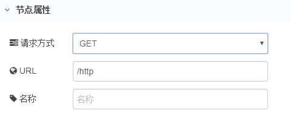
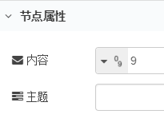

# 逻辑

## Function
        一个javascript函数块，用于针对节点接收的消息运行，消息作为调用的javascript对象传入msg，具有        msg.payload包含消息正文的属性。该函数应该返回一个消息对象（或多个消息对象），也可以选择不返回任何内容以暂停流。

### 一、节点介绍
#### 节点外观


#### 节点属性
+ **名称** | 字符串 用于显示节点名称
+ **函数** | javascript 编写函数
+ **输出** | 数字 传递消息给对应输出个数的节点

**记录和错误处理**

要记录任何信息或报告错误，可以使用以下功能：

    1. node.log("Log message") 日志消息
    2. node.warn("Warning") 警告
    3. node.error("Error") 错误

        Catch节点也可用于处理错误，要调用Catch节点，请将msg第二个参数传递给node.error：`node.error("Error",msg);`

### 二、示例
        示例中包含个别配置字段无法保存，请自行根据现实情况配置。示例中教程可以通过拷贝示例代码实现快速复用，在新建的流程中点击界面右侧 **菜单栏-导入-剪贴板** ，在文本框中粘贴下面代码后点击确定，即可快速复用。

#### 赋值
        用function节点对payload进行赋值。

连接示意图如下。


        function节点配置如下，写入javascript，令payload=123。


        点击定时器，调试结果如下，在调试窗口显示文本123。


示例代码：

```plain
[{"id":"c257bfcf.8971b","type":"tab","label":"流程4","disabled":false,"info":""},{"id":"e773aaba.7d5728","type":"inject","z":"c257bfcf.8971b","name":"","topic":"","payload":"","payloadType":"date","repeat":"","crontab":"","once":false,"onceDelay":0.1,"x":255,"y":160,"wires":[["5de881e0.8d04b"]]},{"id":"556e04e1.3e986c","type":"debug","z":"c257bfcf.8971b","name":"","active":true,"tosidebar":true,"console":false,"tostatus":false,"complete":"false","x":535,"y":160,"wires":[]},{"id":"5de881e0.8d04b","type":"function","z":"c257bfcf.8971b","name":"","func":"msg.payload=\"123\"\nreturn msg;","outputs":1,"noerr":0,"x":400,"y":160,"wires":[["556e04e1.3e986c"]]}]
```

---

## 模板
        模板节点用于写入一个模板，然后将输入消息中的msg对象填充到模板中。

### 一、节点介绍
#### 节点外观


#### 节点属性
+ **名称** | 字符串 用于显示节点名称
+ **设定属性** | 设定输入的属性
    - **msg** | 输入为上一个环节的输出
    - **flow** | 输入本流程中的某个输出
    - **global** | 输入全部流程中的某个输出
+ **格式** | 选择格式为mustache模板或纯文本
+ **模板** | 写入模板
+ **输出** | 可输出纯文本、josn或是yaml

**输入消息属性**

+ **msg** | 对象 包含填充模板信息的msg对象
+ **template** | 模板 从msg.payload填充的模板，如果未在模板节点中配置模板。这视为msg.的属性

### 二、示例
        示例中包含个别配置字段无法保存，请自行根据现实情况配置。示例中教程可以通过拷贝示例代码实现快速复用，在新建的流程中点击界面右侧 **菜单栏-导入-剪贴板** ，在文本框中粘贴下面代码后点击确定，即可快速复用。

#### 配置模板
        用模板节点配置一个模板。

        连接示意图如下。


        function节点配置如下，写入填充模板信息的msg对象。


        模板节点配置如下，设定属性为msg.格式选模板，然后写入模板，输出为纯文本。


        点击定时器，调试结果如下，Red和Monday就被代入到模板中了。


示例代码：

```plain
[{"id":"3bfa18fc.f9d268","type":"tab","label":"流程4","disabled":false,"info":""},{"id":"fbb21307.e40c8","type":"inject","z":"3bfa18fc.f9d268","name":"","topic":"","payload":"","payloadType":"date","repeat":"","crontab":"","once":false,"onceDelay":0.1,"x":215,"y":320,"wires":[["a9c01a28.03c7c8"]]},{"id":"67fdfda7.5406d4","type":"debug","z":"3bfa18fc.f9d268","name":"","active":true,"tosidebar":true,"console":false,"tostatus":false,"complete":"payload","x":595,"y":320,"wires":[]},{"id":"1bae80dc.f457af","type":"template","z":"3bfa18fc.f9d268","name":"","field":"payload","fieldType":"msg","format":"handlebars","syntax":"mustache","template":"Hello {{payload.name}}. Today is {{date}}","output":"str","x":455,"y":320,"wires":[["67fdfda7.5406d4"]]},{"id":"a9c01a28.03c7c8","type":"function","z":"3bfa18fc.f9d268","name":"","func":"msg.payload={name:\"Red\"}\nmsg.date=\"Monday\";\nreturn msg;","outputs":1,"noerr":0,"x":340,"y":320,"wires":[["1bae80dc.f457af"]]}]
```

---

## 延迟
延迟节点用于延迟通过的每条消息或限制它们通过的速率。

### 一、节点介绍
#### 节点外观


#### 节点属性
+ **行为设置** | 选择延迟的类型
    - **延迟每一条消息** | 延迟消息
        * **固定延迟时间** | 数字 延迟固定**数字**的时长（毫秒/秒/分/小时/天）
        * **随机延迟** | 数字 随机延迟**数字**到**数字**间的时间（毫秒/秒/分/小时/天）
        * **允许msg.delay复写延长时间** | 数字 延迟固定**数字**的时长（毫秒/秒/分/小时/天），后更改msg.delay可覆盖默认延迟时间
    - **限制信息速率** | 限制速率
        * **所有信息** | 限制**数字**条信息**数字**（秒/分/小时/天），可勾选不传输中间信息
        * **每一个msg.topic** | 限制**数字**条信息**数字**（秒/分/小时/天），依次发送每个topic或是所有topic
+ **名称** | 字符串 用于显示节点名称

**输入消息属性**

+ **delay** | 设置要应用于消息的延迟，这个选项仅在节点配置为允许消息时才适用，覆盖配置的默认延迟时间间隔
+ **reset** | 如果收到的消息将此属性设置为任何值，则全部节点保留的未完成消息将被清除而不被发送

### 二、示例
示例中包含个别配置字段无法保存，请自行根据现实情况配置。示例中教程可以通过拷贝示例代码实现快速复用，在新建的流程中点击界面右侧 **菜单栏-导入-剪贴板** ，在文本框中粘贴下面代码后点击确定，即可快速复用。

#### 延迟消息的传输
        用延迟节点延迟消息。

        连接示意图如下。


        函数节点配置如下，用于给payload赋值。


        延迟节点配置如下，固定延迟每一条信息5s。


        点击定时器，延迟节点下显示蓝色提升灯，说明消息在延迟节点中延迟，如下图。


        5s后延迟节点恢复正常，并在调试节点显示消息，如下图。


示例代码：

```plain
[{"id":"3bfa18fc.f9d268","type":"tab","label":"流程4","disabled":false,"info":""},{"id":"fbb21307.e40c8","type":"inject","z":"3bfa18fc.f9d268","name":"","topic":"","payload":"","payloadType":"date","repeat":"","crontab":"","once":false,"onceDelay":0.1,"x":215,"y":320,"wires":[["a9c01a28.03c7c8"]]},{"id":"67fdfda7.5406d4","type":"debug","z":"3bfa18fc.f9d268","name":"","active":true,"tosidebar":true,"console":false,"tostatus":false,"complete":"payload","x":595,"y":320,"wires":[]},{"id":"a9c01a28.03c7c8","type":"function","z":"3bfa18fc.f9d268","name":"","func":"msg.payload=\"hello\"\nreturn msg;","outputs":1,"noerr":0,"x":341,"y":320,"wires":[["a8b2947e.9a5438"]]},{"id":"a8b2947e.9a5438","type":"delay","z":"3bfa18fc.f9d268","name":"","pauseType":"delay","timeout":"5","timeoutUnits":"seconds","rate":"1","nbRateUnits":"1","rateUnits":"second","randomFirst":"1","randomLast":"5","randomUnits":"seconds","drop":true,"x":459.5,"y":319,"wires":[["67fdfda7.5406d4"]]}]
```

---

## 触发
        触发节点被触发后，会发送第一条消息，然后在延迟一定时间后发送第二条消息（可周期发送），或是重置前不发送任何消息。

### 一、节点介绍
#### 节点外观


#### 节点属性
+ **发送** | 选择输出第一条消息的类型和内容
    - **flow.** | 输出本流程中的某个路径
    - **global.** | 输出全部流程中的某个路径
    - **文字列** | 字符串 输出文字列消息
    - **数字** | 数字 输出数字消息
    - **布尔** | 布尔值 输出true（真）或false（假）
    - **JOSN** | 对对象赋值输出
    - **二进制流** | 字节值的json数组 编辑器将输入的数值解析为json数组，如果它不是有效的josn，将被视为UTF-8字符串，并被转换为单个字符代码点的数组
    - **时间戳** | 对流输出一次时间戳
    - **env variable** | env 变量
    - **现有信息对象** | 现有的信息对象
    - **无** | 不输出第一条消息
+ **然后** | 选择要发送第二条消息的属性
    - **等待被重置** | 在重置前阻止消息发送
    - **等待** | 等待**数字**（毫秒/秒/分钟/小时）时间后输出第二条消息
    - **周期性重发** | 每隔**数字**（毫秒/秒/分钟/小时）时间后周期性输出第一条消息
+ **重置触发节点条件** | 设置reset或payload等于设置值时重置
+ **名称** | 字符串 用于显示节点名称

**输入消息属性**

+ **reset** | 如果收到带有此属性的消息，则表示超时或重复，当前正在进行中的操作将被清除，并且不会触发任何消息

### 二、示例
        示例中包含个别配置字段无法保存，请自行根据现实情况配置。示例中教程可以通过拷贝示例代码实现快速复用，在新建的流程中点击界面右侧 **菜单栏-导入-剪贴板** ，在文本框中粘贴下面代码后点击确定，即可快速复用。

#### 状态为真2s后为假
        用触发器节点设置输出为真2s后输出为假。

        连接示意图如下。


        触发节点配置如下，发送类型选择布尔型，内容为true，然后等待2s后发送内容为false。


        点击定时器，调试结果如下，在55s时输出为真，2s后输出为假。


示例代码：

```plain
[{"id":"3bfa18fc.f9d268","type":"tab","label":"流程4","disabled":false,"info":""},{"id":"fbb21307.e40c8","type":"inject","z":"3bfa18fc.f9d268","name":"","topic":"","payload":"","payloadType":"date","repeat":"","crontab":"","once":false,"onceDelay":0.1,"x":300,"y":220,"wires":[["71f97c2a.067204"]]},{"id":"67fdfda7.5406d4","type":"debug","z":"3bfa18fc.f9d268","name":"","active":true,"tosidebar":true,"console":false,"tostatus":false,"complete":"payload","x":602,"y":222,"wires":[]},{"id":"71f97c2a.067204","type":"trigger","z":"3bfa18fc.f9d268","op1":"true","op2":"false","op1type":"bool","op2type":"bool","duration":"2","extend":false,"units":"s","reset":"","bytopic":"all","name":"","x":441.5,"y":220,"wires":[["67fdfda7.5406d4"]]}]
```

---

## 注释
        用于向流程添加注释的节点。

### 一、节点介绍
#### 节点外观


#### 节点属性
+ **标题** | 字符串 显示注释的标题
+ **主题** | 字符串 对注释的标题进行备注

### 二、示例
        示例中包含个别配置字段无法保存，请自行根据现实情况配置。示例中教程可以通过拷贝示例代码实现快速复用，在新建的流程中点击界面右侧 **菜单栏-导入-剪贴板** ，在文本框中粘贴下面代码后点击确定，即可快速复用。

#### 注释说明
        用注释节点对各节点进行注释说明。

        示意图如下。


        注释节点配置如下。


示例代码：

```plain
[{"id":"3bfa18fc.f9d268","type":"tab","label":"流程4","disabled":false,"info":""},{"id":"fbb21307.e40c8","type":"inject","z":"3bfa18fc.f9d268","name":"","topic":"","payload":"","payloadType":"date","repeat":"","crontab":"","once":false,"onceDelay":0.1,"x":300,"y":220,"wires":[["67fdfda7.5406d4"]]},{"id":"67fdfda7.5406d4","type":"debug","z":"3bfa18fc.f9d268","name":"","active":true,"tosidebar":true,"console":false,"tostatus":false,"complete":"payload","x":478,"y":220,"wires":[]},{"id":"e4d77b6f.cb3a28","type":"comment","z":"3bfa18fc.f9d268","name":"这是一个定时器","info":"用于输入时间戳","x":265.5,"y":154,"wires":[]},{"id":"889dab09.721a98","type":"comment","z":"3bfa18fc.f9d268","name":"这是一个调试器","info":"用于显示输出结果","x":478,"y":154,"wires":[]}]
```

---

## Http request
Http request节点发送http请求并返回响应。

### 一、节点介绍
#### 节点外观


#### 节点属性
+ **请求方式** | 选择请求的方式
    - **GET** | 请求指定的页面信息，并返回实体主体
    - **POST** | 向指定资源提交数据进行处理请求（例如提交表单或者上传文件），数据被包含在请求体中，POST请求可能会导致新的资源的建立和/或已有资源的修改
    - **PUT** | 从客户端向服务器传送的数据取代指定的文档的内容
    - **DELETE** | 请求服务器删除指定的页面
    - **-用msg.method设定-** | 设置msg.method来请求节点
+ **URL** | 请求访问的地址
+ **返回** | 选择返回的类型（UTF-8字符串/二进制数据/JSON对象）
+ **名称** | 字符串 用于显示节点名称

**输入消息属性**

+ **url** | 如果未在节点中配置url，则可用该属性设置请求的url
+ **方法** | 如果未在节点中配置请求方式，则可用该属性设置请求方法
+ **headers** | 设置请求的http标头
+ **cookies** | 如果设置，可用于发送带有请求的cookie
+ **payload** | 作为请求的正文发送
+ **rejectUnauthorized** | 如果设置为**false**，则允许对使用的https站点发出请求，自签名证书
+ **followRedirects** | 如果设置为**false**，则阻止遵循重定向（http 301），默认**true**

**输出消息属性**

+ **payload** | 回应的主体
+ **statusCode** | 响应的状态代码，如果请求无法完成，则为错误代码
+ **headers** | 包含响应标头的对象
+ **responseUrl** | 如果在处理请求时发生任何重定向，则此属性是最终重定向的URL
+ **responseCookies** | 如果响应包含cookie，则此属性是每个cookie的名称/值对的对象

### 二、示例
        示例中包含个别配置字段无法保存，请自行根据现实情况配置。示例中教程可以通过拷贝示例代码实现快速复用，在新建的流程中点击界面右侧 **菜单栏-导入-剪贴板** ，在文本框中粘贴下面代码后点击确定，即可快速复用。

#### 创建端点请求并返回
        连接示意图如下，用http in节点创建端点、http requset节点发出请求、http out节点返回。


        在函数节点中给payload赋值，值为123。


        http in节点配置如下，请求方式选择get，url中自定义填写创建的端点，这里用/http。



        http requset节点配置如下，请求方式选择get，url中填写请求的网址，末尾/http就是前面创建的端点。


        http out节点不需要配置。

        点击定时器，调试结果如下，payload=123。


        打开网址显示如下，文本123。


示例代码：

```plain
[{"id":"e99dc73.eb9ab38","type":"tab","label":"流程1","disabled":false,"info":""},{"id":"f98a9640.251f48","type":"http in","z":"e99dc73.eb9ab38","name":"","url":"/http","method":"get","upload":false,"swaggerDoc":"","x":483.5,"y":96,"wires":[["629d9fa4.990ad"]]},{"id":"66061d71.239c94","type":"http response","z":"e99dc73.eb9ab38","name":"","statusCode":"","headers":{},"x":748.5,"y":96,"wires":[]},{"id":"629d9fa4.990ad","type":"function","z":"e99dc73.eb9ab38","name":"","func":"msg.payload=\"123\"\nreturn msg;","outputs":1,"noerr":0,"x":621.5,"y":96,"wires":[["66061d71.239c94"]]},{"id":"e14e9b11.b78cb8","type":"debug","z":"e99dc73.eb9ab38","name":"","active":true,"tosidebar":true,"console":false,"tostatus":false,"complete":"true","x":743.5,"y":190,"wires":[]},{"id":"92116bfb.87a668","type":"http request","z":"e99dc73.eb9ab38","name":"","method":"GET","ret":"txt","url":"http://192./http","tls":"","x":619.5,"y":190,"wires":[["e14e9b11.b78cb8"]]},{"id":"78443f03.7c0fe","type":"inject","z":"e99dc73.eb9ab38","name":"","topic":"","payload":"","payloadType":"date","repeat":"","crontab":"","once":false,"onceDelay":0.1,"x":497.5,"y":190,"wires":[["92116bfb.87a668"]]}]
```

---

## Tcp request
        Tcp请求节点，将**msg.payload**发送到服务器tcp端口并期待响应。

### 一、节点介绍
#### 节点外观


#### 节点属性
+ **服务器** | 填写请求地址和端口
+ **返回** | 选择返回的类型
    - **指定时间后** | 指定**数字**毫秒后返回
    - **当收到某个字符为** | 收到某个字符后返回
    - **指定字符数** | 指定**数字**字符后返回
    - **永不** | 保持连接
    - **马上** | 不需要等待回复直接返回
+ **名称** | 字符串 用于显示节点名称

**输入消息属性**

+ **host** | 如果节点未配置主机地址，可设置该属性来配置地址
+ **port** | 如果节点未配置主机端口，可设置该属性来配置端口

**输入消息属性**

+ **payload** | 响应将在此属性中作为缓冲区输出

### 二、示例
        示例中包含个别配置字段无法保存，请自行根据现实情况配置。示例中教程可以通过拷贝示例代码实现快速复用，在新建的流程中点击界面右侧 **菜单栏-导入-剪贴板** ，在文本框中粘贴下面代码后点击确定，即可快速复用。

#### 包体的发送和返回
        用tcp节点实现包体的发送和返回。

        连接示意图如下，用tcp请求节点发送一个包体，tcp in节点接收后由tcp out节点返回。


        tcp in节点配置如下，填写好地址和端口，选择字串流Buffer输出。


        对tcp请求节点和tcp out节点配置同样的地址和端口，点击定时器，调试结果如下，输出28位Buffer。


示例代码：

```plain
[{"id":"e99dc73.eb9ab38","type":"tab","label":"流程1","disabled":false,"info":""},{"id":"c6103221.211e1","type":"tcp in","z":"e99dc73.eb9ab38","name":"","server":"client","host":"192.","port":"1880","datamode":"stream","datatype":"buffer","newline":"","topic":"","base64":false,"x":366.5,"y":147,"wires":[["b5561e25.a3b2c"]]},{"id":"b5561e25.a3b2c","type":"tcp out","z":"e99dc73.eb9ab38","host":"192.9","port":"1880","beserver":"client","base64":false,"end":false,"name":"","x":709.5,"y":150,"wires":[]},{"id":"80397524.9314d8","type":"tcp request","z":"e99dc73.eb9ab38","server":"192.","port":"1880","out":"sit","splitc":" ","name":"","x":505.5,"y":250,"wires":[["ba6caf44.429ce"]]},{"id":"4836a80a.173a38","type":"inject","z":"e99dc73.eb9ab38","name":"","topic":"","payload":"","payloadType":"date","repeat":"","crontab":"","once":false,"onceDelay":0.1,"x":352.5,"y":249,"wires":[["80397524.9314d8"]]},{"id":"ba6caf44.429ce","type":"debug","z":"e99dc73.eb9ab38","name":"","active":true,"tosidebar":true,"console":false,"tostatus":false,"complete":"false","x":713.5,"y":250,"wires":[]}]
```

---

## Switch
Switch节点用于对每个到来的消息与规则进行比较判断，满足规则条件输出，不满足则不输出。

### 一、节点介绍
#### 节点外观


#### 节点属性
+ **名称** | 字符串 用于显示节点名称
+ **属性** | 消息的路径，默认为msg.payload
    - **msg** | 填写上一个环节的输出路径
    - **flow** | 填写本流程中的某个输出路径
    - **global** | 填写全部流程中的某个输出路径
    - **expression** | 填写表达式
+ **规则** | 可添加或删除规则
    - **比较符号** | 选择比较符号（<、>、<=、>=、=等）
    - **内容** | 选择比较消息的属性（msg、数字、文字列等），并写入比较值

### 二、示例
        示例中包含个别配置字段无法保存，请自行根据现实情况配置。示例中教程可以通过拷贝示例代码实现快速复用，在新建的流程中点击界面右侧 **菜单栏-导入-剪贴板** ，在文本框中粘贴下面代码后点击确定，即可快速复用。

#### 判断输出
        用switch节点对输入比较后判断输出。

        连接示意图如下，对输入数值比较，小于5从第一条流输出，大等于5从第二条流输出。


        switch节点配置如下，数值<5从1输出，数值>=5从2输出。


        给定时器一个数值3，点击定时器，调试结果如下，从第一条流输出。


        给定时器一个数值9，点击定时器，调试结果如下，从第二条流输出。




示例代码：

```plain
[{"id":"b7fdf978.a72058","type":"switch","z":"8c0010e8.9851","name":"","property":"payload","propertyType":"msg","rules":[{"t":"lt","v":"5","vt":"num"},{"t":"gte","v":"5","vt":"num"}],"checkall":"true","repair":false,"outputs":2,"x":341.5,"y":640,"wires":[["e4005509.4c9038"],["bf51356a.93a658"]]},{"id":"9fd5e590.3ccb48","type":"inject","z":"8c0010e8.9851","name":"","topic":"","payload":"9","payloadType":"num","repeat":"","crontab":"","once":false,"onceDelay":0.1,"x":193.5,"y":640,"wires":[["b7fdf978.a72058"]]},{"id":"e4005509.4c9038","type":"debug","z":"8c0010e8.9851","name":"小于5","active":true,"tosidebar":true,"console":false,"tostatus":false,"complete":"payload","x":520.5,"y":589,"wires":[]},{"id":"bf51356a.93a658","type":"debug","z":"8c0010e8.9851","name":"大等于5","active":true,"tosidebar":true,"console":false,"tostatus":false,"complete":"payload","x":519.5,"y":689,"wires":[]}]
```

---

## Change
        改变节点用于设置，更改，删除或移动消息，节点将按照定义的顺序应用多个规则。

### 一、节点介绍
#### 节点外观


#### 节点属性
+ **名称** | 字符串 用于显示节点名称
+ **规则** | 定义规则，设置，更改，删除或移动消息
    - **设定** | 给某属性赋值，值可以是各种不同的类型，或可以从现有的消息或上下文属性中获取
    - **修改** | 修改某属性的值
    - **删除** | 删除某个属性
    - **转移** | 移动一个属性的值到另一个属性中

### 二、示例
        示例中包含个别配置字段无法保存，请自行根据现实情况配置。示例中教程可以通过拷贝示例代码实现快速复用，在新建的流程中点击界面右侧 **菜单栏-导入-剪贴板** ，在文本框中粘贴下面代码后点击确定，即可快速复用。

#### 修改属性
        用改变节点修改msg.payload的值。

        连接示意图如下。


        定时器节点配置如下，输出msg.payload的值1。


        改变节点配置如下，写入修改规则，将msg.payload中的1改为2。


        点击定时器，调试结果如下，msg.payload的值改变成了2。


示例代码：

```plain
[{"id":"3ca8f474.b4dcdc","type":"change","z":"8c0010e8.9851","name":"","rules":[{"t":"change","p":"payload","pt":"msg","from":"1","fromt":"num","to":"2","tot":"num"}],"action":"","property":"","from":"","to":"","reg":false,"x":475.5,"y":225,"wires":[["a84b423f.94341"]]},{"id":"a84b423f.94341","type":"debug","z":"8c0010e8.9851","name":"","active":true,"tosidebar":true,"console":false,"tostatus":false,"complete":"false","x":660.5,"y":225,"wires":[]},{"id":"b09f4ae2.34f2c8","type":"inject","z":"8c0010e8.9851","name":"","topic":"","payload":"1","payloadType":"num","repeat":"","crontab":"","once":false,"onceDelay":0.1,"x":357.5,"y":225,"wires":[["3ca8f474.b4dcdc"]]}]
```

---

## Range
        范围节点用于将数值映射到不同的范围，此节点将线性缩放接收的值。默认情况下，结果不受限于节点中定义的范围。

### 一、节点介绍
#### 节点外观


#### 节点属性
+ **属性** | 要调整范围的属性，默认为msg.payload
+ **操作** | 填写输入范围和输出范围
    - **按比例msg.payload** | 按比例改变msg.payload的值
    - **按比例并设定界限至目标范围** | 按比例并设定界限至目标范围，味着结果永远不会在指定的范围外
    - **按比例并包含在目标范围内** | 按比例并包含在目标范围内，意味着结果将会被包裹在结果范围内
+ **名称** | 字符串 用于显示节点名称

### 二、示例
        示例中包含个别配置字段无法保存，请自行根据现实情况配置。示例中教程可以通过拷贝示例代码实现快速复用，在新建的流程中点击界面右侧 **菜单栏-导入-剪贴板** ，在文本框中粘贴下面代码后点击确定，即可快速复用。

#### 改变属性范围
        用范围节点修改msg.payload的范围。

        连接示意图如下。


        定时器节点配置如下，输出msg.payload的值为300。


        范围节点配置如下，将msg.payload的范围从0~~500改为0~~100。


点击定时器，调试结果如下，msg.payload的值按比例缩小改变成了60。


示例代码：

```plain
[{"id":"8c0010e8.9851","type":"tab","label":"流程1","disabled":false,"info":""},{"id":"c72916c3.6442c8","type":"range","z":"8c0010e8.9851","minin":"0","maxin":"500","minout":"0","maxout":"100","action":"scale","round":false,"property":"payload","name":"","x":343.5,"y":329,"wires":[["7dded5f7.22b21c"]]},{"id":"d88861d4.92f8d","type":"inject","z":"8c0010e8.9851","name":"","topic":"","payload":"300","payloadType":"num","repeat":"","crontab":"","once":false,"onceDelay":0.1,"x":213.5,"y":329,"wires":[["c72916c3.6442c8"]]},{"id":"7dded5f7.22b21c","type":"debug","z":"8c0010e8.9851","name":"","active":true,"tosidebar":true,"console":false,"tostatus":false,"complete":"false","x":476.5,"y":329,"wires":[]}]
```

---

## Split
        Split节点用于将一个数组拆分成数个数组元素。

### 一、节点介绍
#### 节点外观


#### 节点属性
+ **字符串/Buffer** | 使用指定的字符（默认值：**\n**），缓冲序列或固定长度拆分消息
+ **数组** | 数字 设置固定长度对数值进行拆分
+ **对象** | 为对象的每个键/值对发送一条消息
+ **名称** | 字符串 用于显示节点名称

**输入消息属性**

+ **payload** | 节点如何拆分由**msg.payload**的类型决定
    - **字符串/buffer** | 使用指定的字符（默认值：**\n**），缓冲序列或固定长度拆分消息
    - **数组** | 数组被拆分为单个数组元素或固定长度的数组
    - **object** | 为对象的每个键/值对发送一条消息

**输出消息属性**

+ **parts** | 此属性包含有关如何拆分数组的信息，如果传递给**join**节点，则序列会被重新组合成一条消息，该节点具有以下特点
    - **id** | 消息组的标识符
    - **index** | 组内的位置
    - **count** | 组的总数量
    - **type** | 消息的类型（字符串/数组/对象/缓冲区）
    - **ch** | 对于字符串或缓冲区，用于将消息拆分为字符串或字节数组的数据
    - **key** | 对于一个对象，此消息是创建属性的键
    - **len** | 使用固定长度值分割时每条消息的长度

### 二、示例
        示例中包含个别配置字段无法保存，请自行根据现实情况配置。示例中教程可以通过拷贝示例代码实现快速复用，在新建的流程中点击界面右侧 **菜单栏-导入-剪贴板** ，在文本框中粘贴下面代码后点击确定，即可快速复用。

#### 数组的拆分合并
        用split节点和join节点对数组进行拆分合并。

        连接示意图如下。


        函数节点配置如下，定义一个数组。


        split节点配置如下，因为是数组，所以填写固定长度即可，这里固定长度选择2。


        join节点配置如下，模式选择自动。


        点击定时器，调试结果如下，split节点将6个元素的数组按长度2分成了3组输出，join节点将长度为2的3组数组合并输出。


示例代码：

```plain
[{"id":"8c0010e8.9851","type":"tab","label":"流程1","disabled":false,"info":""},{"id":"bf654fd4.9ceb1","type":"split","z":"8c0010e8.9851","name":"","splt":"\\n","spltType":"str","arraySplt":"2","arraySpltType":"len","stream":false,"addname":"","x":400.5,"y":366,"wires":[["1c0d8a19.4ee3e6","7bbbe21.501c71c"]]},{"id":"7bbbe21.501c71c","type":"join","z":"8c0010e8.9851","name":"","mode":"auto","build":"string","property":"payload","propertyType":"msg","key":"topic","joiner":"\\n","joinerType":"str","accumulate":false,"timeout":"","count":"","reduceRight":false,"reduceExp":"","reduceInit":"","reduceInitType":"","reduceFixup":"","x":469.5,"y":464,"wires":[["133e366b.a8921a"]]},{"id":"133e366b.a8921a","type":"debug","z":"8c0010e8.9851","name":"合并","active":true,"tosidebar":true,"console":false,"tostatus":false,"complete":"payload","x":579.5,"y":463,"wires":[]},{"id":"357fdb25.0729c4","type":"inject","z":"8c0010e8.9851","name":"","topic":"","payload":"","payloadType":"date","repeat":"","crontab":"","once":false,"onceDelay":0.1,"x":220.5,"y":367,"wires":[["65560beb.ed0864"]]},{"id":"65560beb.ed0864","type":"function","z":"8c0010e8.9851","name":"","func":"msg.payload=[1,2,\"A\",7,\"B\",11]\nreturn msg;","outputs":1,"noerr":0,"x":305.5,"y":367,"wires":[["bf654fd4.9ceb1"]]},{"id":"1c0d8a19.4ee3e6","type":"debug","z":"8c0010e8.9851","name":"拆分","active":true,"tosidebar":true,"console":false,"tostatus":false,"complete":"payload","x":577.5,"y":367,"wires":[]}]
```

---

## Join
        Join节点用于将数个数组元素合并成一个数组。

### 一、节点介绍
#### 节点外观


#### 节点属性
+ **模式** | 有三种模式可供选择
    - **自动** | 与拆分节点配对后，它会自动加入消息以反转已执行的拆分
    - **手动** | 手动加入消息序列
        * **合并每个** | 合并msg.属性
        * **输出为** | 输出可以是（字符串/Buffer/数组/键值对对象/合并对象）
        * **合并符合** | 文字列或二进制流
    - **缩减序列** | 对序列中的所有消息应用表达式以将其减少为单个消息
+ **名称** | 字符串 用于显示节点名称

**输入消息属性**

+ **parts** | 要加入一系列消息，他们应该都有这个属性集。**split**节点会生成此属性，也可以手动创建，它具有以下属性
    - **id** | 消息组的标识符
    - **index** | 组内的位置
    - **count** | 组的总数量
    - **type** | 消息的类型（字符串/数组/对象/缓冲区）
    - **ch** | 对于字符串或缓冲区，用于将消息拆分为字符串或字节数组的数据
    - **key** | 对于一个对象，此消息是创建属性的键
    - **len** | 使用固定长度值分割时每条消息的长度
+ **完成** | 如果设置，节点将以其当前状态发送其输出消息

### 二、示例
        示例中包含个别配置字段无法保存，请自行根据现实情况配置。示例中教程可以通过拷贝示例代码实现快速复用，在新建的流程中点击界面右侧 **菜单栏-导入-剪贴板** ，在文本框中粘贴下面代码后点击确定，即可快速复用。

#### 数组的拆分合并
        用split节点和join节点对数组进行拆分合并。

        连接示意图如下。


        函数节点配置如下，定义一个数组。


        split节点配置如下，因为是数组，所以填写固定长度即可，这里固定长度选择2。


        join节点配置如下，模式选择自动。


        点击定时器，调试结果如下，split节点将6个元素的数组按长度2分成了3组输出，join节点将长度为2的3组数组合并输出。


示例代码：

```plain
[{"id":"8c0010e8.9851","type":"tab","label":"流程1","disabled":false,"info":""},{"id":"bf654fd4.9ceb1","type":"split","z":"8c0010e8.9851","name":"","splt":"\\n","spltType":"str","arraySplt":"2","arraySpltType":"len","stream":false,"addname":"","x":400.5,"y":366,"wires":[["1c0d8a19.4ee3e6","7bbbe21.501c71c"]]},{"id":"7bbbe21.501c71c","type":"join","z":"8c0010e8.9851","name":"","mode":"auto","build":"string","property":"payload","propertyType":"msg","key":"topic","joiner":"\\n","joinerType":"str","accumulate":false,"timeout":"","count":"","reduceRight":false,"reduceExp":"","reduceInit":"","reduceInitType":"","reduceFixup":"","x":469.5,"y":464,"wires":[["133e366b.a8921a"]]},{"id":"133e366b.a8921a","type":"debug","z":"8c0010e8.9851","name":"合并","active":true,"tosidebar":true,"console":false,"tostatus":false,"complete":"payload","x":579.5,"y":463,"wires":[]},{"id":"357fdb25.0729c4","type":"inject","z":"8c0010e8.9851","name":"","topic":"","payload":"","payloadType":"date","repeat":"","crontab":"","once":false,"onceDelay":0.1,"x":220.5,"y":367,"wires":[["65560beb.ed0864"]]},{"id":"65560beb.ed0864","type":"function","z":"8c0010e8.9851","name":"","func":"msg.payload=[1,2,\"A\",7,\"B\",11]\nreturn msg;","outputs":1,"noerr":0,"x":305.5,"y":367,"wires":[["bf654fd4.9ceb1"]]},{"id":"1c0d8a19.4ee3e6","type":"debug","z":"8c0010e8.9851","name":"拆分","active":true,"tosidebar":true,"console":false,"tostatus":false,"complete":"payload","x":577.5,"y":367,"wires":[]}]
```

---

## Sort
Sort节点用于对消息属性或消息序列进行排序。

### 一、节点介绍
#### 节点外观


#### 节点属性
+ **排序属性** | 有msg.和信息队列两种
    - **msg.** | 键值选择元素值或表达式
    - **信息队列** | 键值选择msg.或表达式
+ **顺序** | 升序排列或降序排列
+ **名称** | 字符串 用于显示节点名称

**输入消息属性**

+ **parts** | 此属性包含有关如何拆分数组的信息
    - **id** | 消息组的标识符
    - **index** | 组内的位置
    - **count** | 组的总数量

### 二、示例
        示例中包含个别配置字段无法保存，请自行根据现实情况配置。示例中教程可以通过拷贝示例代码实现快速复用，在新建的流程中点击界面右侧 **菜单栏-导入-剪贴板** ，在文本框中粘贴下面代码后点击确定，即可快速复用。

#### 数组排序
        用sort节点对数组进行排序。

        连接示意图如下。


        函数节点配置如下，定义一个数组。


sort节点配置如下，排列属性选择msg.写上属性payload，键值为元素值，顺序升序。


点击定时器，调试结果如下，数字按升序被重新排列了。


        再将数组中的数字改成字符串试一下，如下图。


        点击定时器，调试结果如下，字母也按顺序排列好了。


示例代码：

```plain
[{"id":"8c0010e8.9851","type":"tab","label":"流程1","disabled":false,"info":""},{"id":"357fdb25.0729c4","type":"inject","z":"8c0010e8.9851","name":"","topic":"","payload":"","payloadType":"date","repeat":"","crontab":"","once":false,"onceDelay":0.1,"x":242.5,"y":361,"wires":[["6fcd64f5.fc5f1c"]]},{"id":"f9de9855.c3c488","type":"sort","z":"8c0010e8.9851","name":"","order":"ascending","as_num":false,"target":"payload","targetType":"msg","msgKey":"","msgKeyType":"elem","seqKey":"payload","seqKeyType":"msg","x":422.5,"y":361,"wires":[["e63bdeca.736a3"]]},{"id":"e63bdeca.736a3","type":"debug","z":"8c0010e8.9851","name":"","active":true,"tosidebar":true,"console":false,"tostatus":false,"complete":"false","x":526.5,"y":361,"wires":[]},{"id":"6fcd64f5.fc5f1c","type":"function","z":"8c0010e8.9851","name":"","func":"msg.payload=[\"Q\",\"H\",\"Y\",\"B\",\"K\",\"C\"]\nreturn msg;","outputs":1,"noerr":0,"x":332,"y":361,"wires":[["f9de9855.c3c488"]]}]
```

---

## Batch
        批量节点用于将接收到的消息按一定规则输出。

### 一、节点介绍
#### 节点外观


#### 节点属性
+ **模式** | 有三种模式可供选择
    - **按指定数量分组** | 当接收的消息满足指定的数量时输出
        * **分组数量** | 设值分组数量，当接收消息达到这个数量时统一输出
        * **队末队首重叠数量** | 下一次输出消息的队首消息重复本次输出消息的队末消息，数量决定重复个数
    - **按时间间隔分组** | 升接收的消息按时间间隔输出
        * **时间间隔** | 设值时间间隔，间隔内接收的消息会在间隔时统一输出
    - **按主题分组** | 添加主题分组
+ **名称** | 字符串 用于显示节点名称

### 二、示例
        示例中包含个别配置字段无法保存，请自行根据现实情况配置。示例中教程可以通过拷贝示例代码实现快速复用，在新建的流程中点击界面右侧 **菜单栏-导入-剪贴板** ，在文本框中粘贴下面代码后点击确定，即可快速复用。

#### 分组输出
        用批量节点对消息进行分组输出。

        连接示意图如下。


        定时器节点配置如下，周期性每2s输出一个消息1。


        批量节点配置如下，指定分组数量为3，也就是说在每个6s中，批量节点就会收到定时器发来的3条消息，然后输出。


        join节点用于将3条消息合并为一个数组，模式选择自动即可，调试结果如下，每6s输出一个由三个消息1组成的数组。


示例代码：

```plain
[{"id":"8c0010e8.9851","type":"tab","label":"流程1","disabled":false,"info":""},{"id":"357fdb25.0729c4","type":"inject","z":"8c0010e8.9851","name":"","topic":"","payload":"1","payloadType":"num","repeat":"2","crontab":"","once":false,"onceDelay":0.1,"x":361.5,"y":364,"wires":[["2027cfcc.f3402"]]},{"id":"e63bdeca.736a3","type":"debug","z":"8c0010e8.9851","name":"","active":false,"tosidebar":true,"console":false,"tostatus":false,"complete":"false","x":662.5,"y":365,"wires":[]},{"id":"2027cfcc.f3402","type":"batch","z":"8c0010e8.9851","name":"","mode":"count","count":"3","overlap":"0","interval":10,"allowEmptySequence":false,"topics":[],"x":473.5,"y":364,"wires":[["ec6697ca.d4b7f8"]]},{"id":"ec6697ca.d4b7f8","type":"join","z":"8c0010e8.9851","name":"","mode":"auto","build":"string","property":"payload","propertyType":"msg","key":"topic","joiner":"\\n","joinerType":"str","accumulate":false,"timeout":"","count":"","reduceRight":false,"reduceExp":"","reduceInit":"","reduceInitType":"","reduceFixup":"","x":561.5,"y":365,"wires":[["e63bdeca.736a3"]]}]
```


> 更新: 2024-03-21 14:18:40  
> 原文: <https://www.yuque.com/iot-fast/ckyq/ayuhgv>