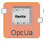

# 采集引擎

## CJT188
        CJT188是国家CJ/T188-2004通讯协议，该控件仅支持读取数据。

### 一、节点介绍
#### 节点外观


#### 节点属性
+ **名称** | 字符串 用于显示节点名称
+ **服务器** | 配置服务器信息
    - **名称** | 用于显示服务器名
    - **通讯方式** | 选择服务器的通讯模式，有TCP,Serial两种模式
        * **TCP** | TCP模式
            + **地址** | 服务器的IP地址
            + **端口** | 服务器的IP端口
        * **Serial** | Serial模式
            + **串行端口** | 设备挂载的端口地址
            + **波特率** | 设置挂载的设备的波特率
            + **数据位** | 挂载设备的数据位
            + **停止位** | 挂载设备的停止位
            + **奇偶检验** | 挂载设备的校验方式
    - **单元-ID** | 设备号
+ **标签** | 上环节msg.payload对象赋值的key名
+ **表类型** | 10-水表、30-气表、40-电表
+ **地址域** | 表计地址
+ **控制码** | 01-读表 03-读表号
+ **标识符** | 901F/1F90-读表数据 810A/0A81-读表号
+ **长度** | 数据域长度
+ **算法** | 值进行换算,格式如：%s/10

**输出消息属性**

+ **payload** | 采集到的数据信息
+ **_countStart** | 发包次数
+ **_countEnd** | 失败次数
+ **sucess** | 通讯结果true/false

---

## 电表DLT64597
        电表DLT64597是国家电表DLT645-07通讯协议，该控件仅支持读取数据。

### 一、节点介绍
#### 节点外观


#### 节点属性
+ **名称** | 字符串 用于显示节点名称
+ **服务器** | 配置服务器信息
    - **名称** | 用于显示服务器名
    - **通讯方式** | 选择服务器的通讯模式
    - **地址** | 服务器的IP地址
    - **端口** | 服务器的IP端口
+ **标识符** | 上环节msg.payload对象赋值的key名
+ **功能名称** | 备注
+ **地址** | 电表表地址
+ **长度** | 连续读取地址长度
+ **算法** | 值进行换算,格式如：%s/10

**输出消息属性**

+ **payload** | 采集到的数据信息
+ **_countStart** | 发包次数
+ **_countEnd** | 失败次数
+ **sucess** | 通讯结果，成功或者失败(true/false)

---

## 电表DLT64597
        DLT64597是国家DL/T645-1997通讯协议,国家电表仪表通讯标准，该控件仅支持读取数据。

### 一、节点介绍
#### 节点外观


#### 节点属性
+ **名称** | 字符串 用于显示节点名称
+ **服务器** | 配置服务器信息
    - **名称** | 用于显示服务器名
    - **通讯方式** | 选择服务器的通讯模式，有TCP,Serial两种模式
        * **TCP** | TCP模式
            + **地址** | 服务器的IP地址
            + **端口** | 服务器的IP端口
        * **Serial** | Serial模式
            + **串行端口** | 设备挂载的端口地址
            + **波特率** | 设置挂载的设备的波特率
            + **数据位** | 挂载设备的数据位
            + **停止位** | 挂载设备的停止位
            + **奇偶检验** | 挂载设备的校验方式
    - **单元-ID** | 设备号
+ **标签** | 上环节msg.payload对象赋值的key名
+ **地址域** | 表计地址
+ **控制码** | 01
+ **数据域** | 功能项标识符
+ **长度** | 数据域长度
+ **算法** | 值进行换算,格式如：%s/10

**输出消息属性**

+ **payload** | 采集到的数据信息
+ **_countStart** | 发包次数
+ **_countEnd** | 失败次数
+ **sucess** | 通讯结果true/false

---

## 欧姆龙Fins
欧姆龙Fins是欧姆龙公司通讯工控设备指令，该控件仅支持读取数据。

### 一、节点介绍
#### 节点外观


#### 节点属性
+ **名称** | 字符串 用于显示节点名称
+ **服务器** | 配置服务器信息
    - **名称** | 用于显示服务器名
    - **通讯方式** | 选择服务器的通讯模式，有TCP,Serial两种模式
        * **TCP** | TCP模式
            + **地址** | 服务器的IP地址
            + **端口** | 服务器的IP端口
        * **Serial** | Serial模式
            + **串行端口** | 设备挂载的端口地址
            + **波特率** | 设置挂载的设备的波特率
            + **数据位** | 挂载设备的数据位
            + **停止位** | 挂载设备的停止位
            + **奇偶检验** | 挂载设备的校验方式
    - **本机网络号** | 本地网格号，例如：192
    - **PLC网络号** | PLC网格号，例如：192
    - **PLC单元号** | PLC设备号
+ **标识符** | 上环节msg.payload对象赋值的key名
+ **功能名称** | 备注
+ **内存域** | PLC内存区
+ **地址** | PLC内存区读取地址
+ **长度** | 连续读取地址长度
+ **数据类型** | PLC返回十六进制值进行转换
+ **算法** | 值进行换算,格式如：%s/10

**输出消息属性**

+ **payload** | 采集到的数据信息
+ **_countStart** | 发包次数
+ **_countEnd** | 失败次数
+ **sucess** | 通讯结果true/false

---

## 欧姆龙HostLink
        欧姆龙HostLink是Hostlink通讯协议,欧姆龙公司通讯工控设备指令。

### 一、节点介绍
#### 节点外观


#### 节点属性
+ **名称** | 字符串 用于显示节点名称
+ **服务器** | 配置服务器信息
    - **名称** | 用于显示服务器名
    - **通讯方式** | 选择服务器的通讯模式，有TCP,Serial两种模式
        * **TCP** | TCP模式
            + **地址** | 服务器的IP地址
            + **端口** | 服务器的IP端口
        * **Serial** | Serial模式
            + **串行端口** | 设备挂载的端口地址
            + **波特率** | 设置挂载的设备的波特率
            + **数据位** | 挂载设备的数据位
            + **停止位** | 挂载设备的停止位
            + **奇偶检验** | 挂载设备的校验方式
    - **单元号-ID** | 设备号
+ **标识符** | 上环节msg.payload对象赋值的key名
+ **功能名称** | 备注
+ **内存域** | PLC内存区
+ **地址** | PLC内存区读取地址
+ **长度** | 连续读取地址长度
+ **数据类型** | PLC返回十六进制值进行转换
+ **算法** | 值进行换算,格式如：%s/10

**输出消息属性**

+ **payload** | 采集到的数据信息
+ **_countStart** | 发包次数
+ **_countEnd** | 失败次数
+ **sucess** | 通讯结果true/false

---

## 三菱FX
        三菱FX是FX通讯协议,三菱公司通讯工控设备指令该控件仅支持读取数据。

### 一、节点介绍
#### 节点外观


#### 节点属性
+ **名称** | 字符串 用于显示节点名称
+ **服务器** | 配置服务器信息
    - **名称** | 用于显示服务器名
    - **通讯方式** | 选择服务器的通讯模式，有TCP,Serial两种模式
        * **TCP** | TCP模式
            + **地址** | 服务器的IP地址
            + **端口** | 服务器的IP端口
        * **Serial** | Serial模式
            + **串行端口** | 设备挂载的端口地址
            + **波特率** | 设置挂载的设备的波特率
            + **数据位** | 挂载设备的数据位
            + **停止位** | 挂载设备的停止位
            + **奇偶检验** | 挂载设备的校验方式
+ **标识符** | 上环节msg.payload对象赋值的key名
+ **功能名称** | 备注
+ **内存域** | PLC内存区
+ **地址** | PLC内存区读取地址
+ **长度** | 连续读取地址长度
+ **数据类型** | PLC返回十六进制值进行转换
+ **算法** | 值进行换算,格式如：%s/10

**输出消息属性**

+ **payload** | 采集到的数据信息
+ **_countStart** | 发包次数
+ **_countEnd** | 失败次数
+ **sucess** | 通讯结果true/false

---

## 三菱MC
        三菱MC是MC通讯协议,三菱公司通讯工控设备指令该控件仅支持读取数据。

### 一、节点介绍
#### 节点外观


#### 节点属性
+ **名称** | 字符串 用于显示节点名称
+ **服务器** | 配置服务器信息
    - **名称** | 用于显示服务器名
    - **通讯方式** | 选择服务器的通讯模式，有TCP,Serial两种模式
        * **TCP** | TCP模式
            + **地址** | 服务器的IP地址
            + **端口** | 服务器的IP端口
        * **Serial** | Serial模式
            + **串行端口** | 设备挂载的端口地址
            + **波特率** | 设置挂载的设备的波特率
            + **数据位** | 挂载设备的数据位
            + **停止位** | 挂载设备的停止位
            + **奇偶检验** | 挂载设备的校验方式
    - **通讯模式** | 三菱MC协议有两种模式，Binaty和ASCII
+ **标识符** | 上环节msg.payload对象赋值的key名
+ **功能名称** | 备注
+ **内存域** | PLC内存区
+ **地址** | PLC内存区读取地址
+ **长度** | 连续读取地址长度
+ **数据类型** | PLC返回十六进制值进行转换
+ **算法** | 值进行换算,格式如：%s/10

**输出消息属性**

+ **payload** | 采集到的数据信息
+ **_countStart** | 发包次数
+ **_countEnd** | 失败次数
+ **sucess** | 通讯结果true/false

---

## 罗克韦尔Logix
        罗克韦尔Logix是Logix通讯协议,罗克韦尔(AB)通讯工控设备指令该控件仅支持读取数据。

### 一、节点介绍
#### 节点外观


#### 节点属性
+ **名称** | 字符串 用于显示节点名称
+ **服务器** | 配置服务器信息
    - **名称** | 用于显示服务器名
    - **通讯方式** | 选择服务器的通讯模式
        * **TCP** | TCP模式
            + **地址** | 服务器的IP地址
            + **端口** | 服务器的IP端口
+ **标识符** | 上环节msg.payload对象赋值的key名
+ **功能名称** | 备注
+ **地址** | PLC内存区读取地址
+ **算法** | 值进行换算,格式如：%s/10

**输出消息属性**

+ **payload** | 采集到的数据信息
+ **_countStart** | 发包次数
+ **_countEnd** | 失败次数
+ **sucess** | 通讯结果true/false

---

## 松下Mewtocol
        松下Mewtocol是Mewtocol通讯协议，松下公司通讯工控设备指令该控件仅支持读取数据。

### 一、节点介绍
#### 节点外观


#### 节点属性
+ **名称** | 字符串 用于显示节点名称
+ **服务器** | 配置服务器信息
    - **名称** | 用于显示服务器名
    - **通讯方式** | 选择服务器的通讯模式，有TCP,Serial两种模式
        * **TCP** | TCP模式
            + **地址** | 服务器的IP地址
            + **端口** | 服务器的IP端口
        * **Serial** | Serial模式
            + **串行端口** | 设备挂载的端口地址
            + **波特率** | 设置挂载的设备的波特率
            + **数据位** | 挂载设备的数据位
            + **停止位** | 挂载设备的停止位
            + **奇偶检验** | 挂载设备的校验方式
    - **单元号-ID** | 设备号
+ **标识符** | 上环节msg.payload对象赋值的key名
+ **功能名称** | 备注
+ **内存域** | PLC内存区
+ **地址** | PLC内存区读取地址
+ **长度** | 连续读取地址长度
+ **数据类型** | PLC返回十六进制值进行转换
+ **算法** | 值进行换算,格式如：%s/10

**输出消息属性**

+ **payload** | 采集到的数据信息
+ **_countStart** | 发包次数
+ **_countEnd** | 失败次数
+ **sucess** | 通讯结果true/false

---

## 西门子S7
        西门子S7是Mewtocol通讯协议，松下公司通讯工控设备指令该控件仅支持读取数据。

### 一、节点介绍
#### 节点外观


#### 节点属性
+ **名称** | 字符串 用于显示节点名称
+ **服务器** | 配置服务器信息
    - **名称** | 用于显示服务器名
    - **通讯方式** | 选择服务器的通讯模式
        * **TCP** | TCP模式
            + **地址** | 服务器的IP地址
            + **端口** | 服务器的IP端口
    - **模式** | S7协议模式，TSAP和Rack-Slot两种模式
        * **TSAP** | \
            + **本地TSAP** | 本地TSAP
            + **远程TSAP** | 远程TSAP
        * **Rack-Slot** | \
            + **架** | 设备机架
            + **插槽** | 设备槽位
    - **调试** | Default (command line)，on和off
+ **标识符** | 上环节msg.payload对象赋值的key名
+ **功能名称** | 备注
+ **内存域** | PLC内存区
+ **地址** | 内存区读取地址
+ **数据类型** | 读取的地址数据类型，如bit、byte、int等
+ **算法** | 值进行换算，格式如：%s/10

**输出消息属性**

+ **payload** | 采集到的数据信息
+ **_countStart** | 发包次数
+ **_countEnd** | 失败次数
+ **sucess** | 通讯结果true/false

---

## Modbus
        Modbus是Modbus通讯协议,该控件仅支持读取数据。

### 一、节点介绍
#### 节点外观


#### 节点属性
+ **名称** | 字符串 用于显示节点名称
+ **服务器** | 配置服务器信息
    - **名称** | 用于显示服务器名
    - **协议类型** | 显示协议类型
        * **Modbus-TCP** | ModbusTCP类型
            + **地址** | 服务器的IP地址
            + **端口** | 服务器的IP端口
            + **通讯模式** | 选择服务器的通讯模式，有Defautl、RTU-Buffered、Telnet、C701四种模式
        * **Modbus-Serial** | Modbus串口类型
            + **串行端口** | 设备挂载的端口地址
            + **通讯模式** | 设置与挂载的设备的通讯模式，有RTU-Buffered、RTU、ASCII三种模式
            + **波特率** | 设置挂载的设备的波特率
        * **Modbus-SerialExpert** | 对Modbus串口类型进行扩展
            + **串行端口** | 设备挂载的端口地址
            + **通讯模式** | 与挂载设备的通讯模式，有RTU-Buffered、RTU、ASCII三种模式
            + **波特率** | 挂载设备的波特率
            + **数据位** | 挂载设备的数据位
            + **停止位** | 挂载设备的停止位
            + **奇偶检验** | 挂载设备的校验方式
    - **单元-ID** | 设备号
    - **超时** | 设备在设置时间内无响应，返回超时
    - **间隔** | 对设备进行高速连续性发包时，用于设置设备的等待时间
+ **功能码** | 用于标明一个Modbus信息帧的用途
    - **FC 1** | 读取线圈状态
    - **FC 2** | 读取输入状态
    - **FC 3** | 读取保持寄存器
    - **FC 4** | 读取输入寄存器
+ **标识符** | 上环节msg.payload对象赋值的key名
+ **功能名称** | 备注
+ **单元-ID** | 设备号（注：如果这里没有设置，默认服务器配置里的单元-ID）
+ **地址** | 读取地址,格式如：0
+ **长度** | 连续读取地址长度
+ **数据类型** | PLC返回十六进制值进行转换
+ **算法** | 值进行换算,格式如：%s/10

**输出消息属性**

+ **payload** | 采集到的数据信息
+ **_countStart** | 发包次数
+ **_countEnd** | 失败次数
+ **sucess** | 通讯结果，成功或者失败(true/false)

---

## OpcUa
OpcUa是OpcUa通讯协议,通讯工控设备指令该控件仅支持读取数据。

### 一、节点介绍
#### 节点外观


#### 节点属性
+ **名称** | 字符串 用于显示节点名称
+ **服务器** | 配置服务器信息
    - **名称** | 用于显示服务器名
    - **通讯方式** | 选择服务器的通讯模式
        * **TCP** | TCP模式
            + **地址** | 服务器的IP地址，格式为：opc.tcp://127.0.0.1:4840
+ **标识符** | 上环节msg.payload对象赋值的key名
+ **功能名称** | 备注
+ **地址** | PLC内存区读取地址
+ **算法** | 值进行换算,格式如：%s/10

**输出消息属性**

+ **payload** | 采集到的数据信息
+ **_countStart** | 发包次数
+ **_countEnd** | 失败次数
+ **sucess** | 通讯结果true/false

---

## 自定义协议
        自定义协议是用户自定义协议-工业采集控件,支持TCP、Serial通讯方式。自定义协议是用户自定义协议-工业采集控件,支持TCP、Serial通讯方式。

### 一、节点介绍
#### 节点外观


#### 节点属性
+ **名称** | 字符串 用于显示节点名称
+ **服务器** | 配置服务器信息
    - **名称** | 用于显示服务器名
    - **通讯方式** | 选择服务器的通讯模式，有TCP,Serial两种模式
        * **TCP** | TCP模式
            + **地址** | 服务器的IP地址
            + **端口** | 服务器的IP端口
        * **Serial** | Serial模式
            + **串行端口** | 设备挂载的端口地址
            + **波特率** | 设置挂载的设备的波特率
            + **数据位** | 挂载设备的数据位
            + **停止位** | 挂载设备的停止位
            + **奇偶检验** | 挂载设备的校验方式
+ **协议** | 配置协议所需内容
    - **服务器参数** | 用于拓展服务器连接所需字段。
    - **字典参数** | 用于拓展数据字典所需字段。
    - **重构协议** | 用于重构解析报文体，含如下函数：  
//该函数用于连接服务器发起连接报文  
//参数server为服务器配置值  
function Hand(server) {  
  return null;  
}  
//该函数用于合并数据字典  
//参数columns为数据字典配置值，msg为上环节值  
//return【ReadLength】读取长度【GroupType】合并类型【GroupValue】合并判断值【GroupLimit】限制合并长度  
//return 值可拓展，MessageStructure方法【option】参数取到返回值，OutArithmetic方法【curJson】参数取到返回值  
function InArithmetic(columns, msg) {  
  return { 

```plain
"ReadLength": 1,
   "GroupType": "GroupType", 
   "GroupValue":   
   "GroupValue", 
   "GroupLimit": 100 
  };
```

    - }  
//该函数用于请求服务器  
//参数option为合并后对象，server为服务器配置值  
//return 为通讯设备包值  
function MessageStructure(option, server) {  
  return "write";  
}  
//该函数用于合并服务器应答  
//参数data为设备返回值，cache为暂存对象  
//return 【resData】为合并返回值【cache】cache为暂存对象  
//【resData】为null继续等待设备后期返回值  
function DataMerge(data, cache) {  
  return { 

```plain
"resData": resData, 
  "cache": cache 
  };
```

    - } //该函数用于返回下环节值  
//参数data为设备返回的值，index为当前行号，inJson为合并后对象，curJson为当前行号InArithmetic方法返回值，msg为上环节值  
//return 为最终返回下环节值  
function OutArithmetic(data, index, inJson, curJson, msg) {  
   return null;  
}


> 更新: 2024-03-21 14:18:48  
> 原文: <https://www.yuque.com/iot-fast/ckyq/qngm9e>